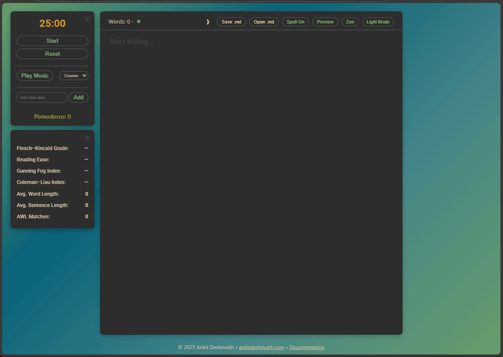

**Help Document: Pomodoro Writer**

**Author:** Dr. Ankit Deshmukh

**LInk:** [Pomodoro Writer](https://ankitdeshmukh.com/projects/pomodorowriter/)

**Purpose:**
This web application is designed as a distraction-free writing environment that integrates a Pomodoro timer, task management, real-time text quality assessment, and support for Mermaid diagrams. Its goal is to help writers, researchers, and creatives stay focused, track writing metrics, manage tasks, and visualize ideas in diagrammatic form—all within a single interface.

[](https://ankitdeshmukh.com/projects/pomodorowriter/)

---

## 1. Overview of Features

1. **Distraction-Free Writing Canvas**

   * A central editor powered by CodeMirror (theme: “gruvbox” in dark mode or default in light mode) that offers a clean, full-screen writing surface.
   * Supports Markdown syntax; you can write plain text, headings, lists, code blocks, and more.
   * Zen Mode: removes all UI elements except the editor itself to minimize distractions.

2. **Pomodoro Timer & Task Management**

   * A fixed-position Pomodoro timer in the top-right corner that starts with a default 25:00 countdown.
   * Controls to Start/Pause and Reset the timer.
   * Select from multiple background audio tracks (“Cosmic,” “Muse,” “Burble,” “Focus”) to play during work sessions (audio unlock required on first click/touch).
   * Task input field and task list under the timer:

     * Add new tasks with a single click or by pressing Enter.
     * Mark tasks complete/incomplete (✔ or ↺) and delete tasks (✕).
     * Task state persists in localStorage, so your list remains available on page reload.
   * Pomodoro count below the timer, incrementing each time you complete a full interval.

3. **Real-Time Writing Analytics & Readability Metrics**

   * Word count and basic Flesch–Kincaid Grade readability displayed in the top header (“Words: X · Readability: Y.Y”).
   * An assessment panel in the top-left corner (collapsible) showing:

     * **Flesch–Kincaid Grade** (U.S. school grade level)
     * **Reading Ease** (0–100 scale; higher = easier)
     * **Gunning Fog Index** (complexity based on complex words)
     * **Coleman–Liau Index** (grade level based on letter/sentence counts)
     * **Avg. Word Length** (characters per word)
     * **Avg. Sentence Length** (words per sentence)
     * **AWL Matches** (count of words from the Academic Word List)
   * These metrics update on every change to your text.

4. **Markdown Preview with Mermaid Diagram Support**

   * Toggle between Editor and Preview modes via the “Preview” button (or Ctrl + L).
   * In Preview mode:

     * Renders your Markdown into HTML (using marked.js).
     * Renders Math expressions via KaTeX (delimiters: `$…$`, `$$…$$`, `\(...\)`, `\[...\]`).
     * Detects fenced code blocks labeled “mermaid” (`mermaid … `) and automatically renders diagrams using Mermaid.js.
     * Provides “Export SVG” and “Export PNG” buttons below each rendered Mermaid diagram, so you can download high-quality graphics.

5. **Theme & Spellcheck Toggles**

   * **Theme Toggle:** Switch between Dark Mode and Light Mode.

     * In Dark Mode: background gradient of deep blues/greens; CodeMirror theme “gruvbox.”
     * In Light Mode: brighter gradient of yellows/oranges; CodeMirror theme “default.”
   * **Spellcheck Toggle:** Enable/disable browser spellchecking within the editor (Ctrl + K).
   * **Zen Mode:** Hide header, footer, timers, and assessment panel for an immersive full-screen writing experience (Ctrl + Z or click “Zen”).

6. **File Operations (Save/Open Markdown)**

   * **Save (.md):** If your browser supports the File System Access API, click “Save .md” (or press Ctrl + S) to choose a location and save your document as a Markdown file.
   * **Open (.md):** Click “Open .md” (or press Ctrl + O) to load an existing Markdown file into the editor.

7. **Keyboard Shortcuts**

   * **F11 / Esc:** Toggle CodeMirror full-screen in the editor.
   * **Ctrl + L (⌘ + L):** Toggle between Editor and Preview modes.
   * **Ctrl + K (⌘ + K):** Toggle spellcheck on/off.
   * **Ctrl + Z (⌘ + Z):** Enter/exit Zen Mode.
   * **Ctrl + M (⌘ + M):** Minimize/restore the Pomodoro timer and assessment panel.
   * **Ctrl + S (⌘ + S):** Save Markdown file (if supported).
   * **Ctrl + O (⌘ + O):** Open Markdown file.

8. **Footer & Attribution**

   * At the bottom of the page, a footer displays “© 2025 Ankit Deshmukh,” with links back to the main site and to the “Features” page.

---

## 2. Detailed Purpose

1. **Distraction-Free Composition**

   * By providing a minimalist writing container and optional Zen Mode, the tool helps you eliminate clutter and focus solely on your words.
   * Keyboard shortcuts and smoothly animated transitions preserve immersion.

2. **Time Management (Pomodoro Technique)**

   * The integrated Pomodoro timer encourages sustained, focused writing sessions of 25 minutes, followed by breaks.
   * Background audio options (unlock on first interaction) allow you to choose ambient tracks that suit your concentration style.
   * Seeing your completed Pomodoros tallied motivates continued productivity.

3. **Task Tracking**

   * Lightweight task list alongside the timer helps you jot down writing sub-tasks (e.g., “Finish intro,” “Insert sources,” “Add diagram”).
   * Easily mark tasks done or delete them, keeping your task list concise and up to date.

4. **Real-Time Readability & Quality Metrics**

   * As you type, readability indices give you immediate feedback on how accessible your writing is.
   * Word count and Flesch–Kincaid Grade display in the header remind you of progress and difficulty level at a glance.
   * Academic Word List (AWL) count helps academic writers track usage of high-level vocabulary.

5. **Visual Thinking with Mermaid Diagrams**

   * Writers and researchers often need to sketch flowcharts, graphs, or conceptual maps. Mermaid integration in Markdown preview means you can write a simple code block like:

     ````
     ```mermaid
     graph TD
       A[Start] --> B{Decision}
       B -->|Yes| C[Option 1]
       B -->|No| D[Option 2]
     ```
     ````
   * On Preview, that block renders as a scalable diagram. You can then export it as SVG or PNG for inclusion in presentations, papers, or notes.

---

## 3. How to Use It

Follow these steps to get the most out of the Pomodoro Writer with Mermaid:

1. **Access & Initial Setup**

   * Open the webpage in a modern browser (Chrome, Edge, or any Chromium-based browser recommended for File System API support).
   * On first click or touch anywhere, the app unlocks audio so that background tracks will play when you start the timer.

2. **Writing in the Editor**

   * Click inside the large editing area (or press any key) to begin.
   * Write in Markdown: use `#`, `##`, `###` for headings; `-` or `*` for lists; `` `inline code` `` and triple-backticks for code blocks.
   * To insert a Mermaid diagram, type:

     ````
     ```mermaid
     [your Mermaid syntax here]
     ```
     ````
   * CodeMirror will provide syntax highlighting, automatic line wrapping, and a contenteditable experience similar to a modern writing app.

3. **Monitoring Word Count & Readability**

   * Above the editor, you’ll see “Words: 0 · Readability: —” update in real time.
   * The assessment panel (top-left) displays deeper metrics (Flesch–Kincaid Grade, Reading Ease, etc.).
   * If you prefer more space, collapse the assessment panel by clicking the “✕” icon next to “Assessment.”

4. **Using the Pomodoro Timer**

   * Locate the Pomodoro timer in the top-right corner. By default, it shows “25:00.”
   * Click **Start** to begin the countdown. The selected background audio will play.
   * When the timer reaches zero, an alert notifies you: “Pomodoro complete!” and your Pomodoro count increments by one.
   * Click **Pause** to pause the session at any time. Click **Reset** to drop the timer back to 25:00 and pause.
   * Use the **Minimize** (✕) button to collapse the timer into a small icon; click again to restore. You can also press Ctrl + M (⌘ + M) to toggle minimize.

5. **Task Management**

   * Under the timer, type a task description into the “Add new task…” input and click **Add** (or press Enter).
   * Your task appears in a list below, each with two buttons: ✔ / ↺ to mark complete/incomplete and ✕ to delete.
   * Completed tasks are drawn with a strikethrough and a green tint. All tasks persist via localStorage, so you can close/reopen the page without losing them.

6. **Preview & Exporting Diagrams**

   * Click **Preview** (or press Ctrl + L) to switch from the editor to the rendered view.
   * The preview pane shows your Markdown as HTML, renders math expressions with KaTeX, and converts Mermaid code blocks into live diagrams.
   * Below each rendered Mermaid diagram, two buttons appear: **Export SVG** and **Export PNG**:

     * **Export SVG:** Immediately downloads the diagram as a `.svg` file.
     * **Export PNG:** Prompts you to enter a resolution scale (1–6 recommended). After entering a number (e.g., “3”), it uses html2canvas to create a high-resolution PNG.
   * Click **Edit** (or Ctrl + L again) to return to the Markdown editor.

7. **Theme, Spellcheck, and Zen Mode**

   * **Theme (Light/Dark):** Click **Light Mode** to switch to a light theme; click again (now “Dark Mode”) to revert. The CodeMirror theme and page colors update instantly.
   * **Spell On/Off:** Click **Spell On** to enable browser spellcheck; the button toggles to “Spell Off.” You can also press Ctrl + K.
   * **Zen Mode:** Click **Zen** (or press Ctrl + Z) to hide header, footer, timer, and assessment panel. Your editor expands to fill more of the screen. To exit Zen Mode, click **Exit Zen** (or press Esc or Ctrl + Z).

8. **Saving & Opening Markdown Files**

   * **Save .md:** If your browser supports the File System Access API (Chrome, Edge), click **Save .md** (or press Ctrl + S). A “Save file” dialog appears; choose a location and filename (default: “document.md”). On successful save, the button briefly pulses, and the writing container glows to confirm.
   * **Open .md:** Click **Open .md** (or press Ctrl + O) to select an existing Markdown file (`*.md`) from your local drive. Once loaded, its contents replace the current editor text, and all stats/assessments update immediately.

9. **Keyboard Shortcuts Recap**

   * **F11:** Enter/exit CodeMirror full-screen editing.
   * **Esc:** Exit full-screen or Zen Mode.
   * **Ctrl + L:** Toggle Editor/Preview.
   * **Ctrl + K:** Toggle Spellcheck.
   * **Ctrl + M:** Minimize/Restore Pomodoro & Assessment panels.
   * **Ctrl + S:** Save Markdown.
   * **Ctrl + O:** Open Markdown.
   * **Ctrl + Z:** Enter/exit Zen Mode.

---

## 4. Tips for Effective Use

* **Leverage the Pomodoro Technique:** Keep your writing sessions short and focused. Use the built-in timer rather than a separate app. Each completed session (25 minutes) increments your Pomodoro counter—watch it grow as motivation.
* **Manage Tasks Inline:** Rather than maintaining a separate to-do list, jot down quick tasks (“Outline section 2,” “Proofread intro”) directly under the timer. Marking them off feels rewarding and keeps you on track.
* **Monitor Readability:** As a researcher or content creator, you may want to target a specific audience. The Flesch–Kincaid Grade and Reading Ease scores help you adjust sentence structure and vocabulary in real time.
* **Build Diagrams as You Write:** When describing processes, use Mermaid code blocks so you can visualize system flows, decision trees, or data pipelines right within the editor. Export them as SVG/PNG for inclusion in reports or presentations.
* **Use Zen Mode for Deep Focus:** When drafting or brainstorming, enter Zen Mode to remove all UI distractions. Your entire viewport becomes a blank canvas.

---

**Best of Luck! Happy Writing!**
