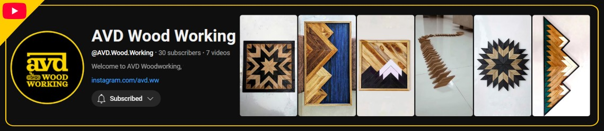
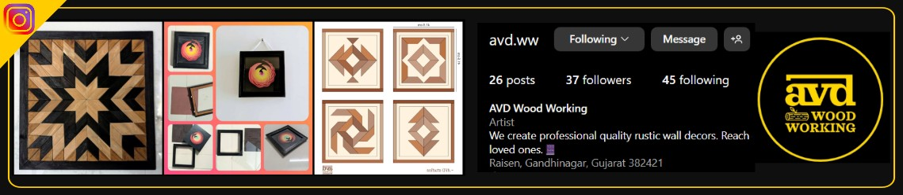

#### YouTube: A library of my wood working projects <a href="https://www.youtube.com/@AVD.Wood.Working">@avd.wood.working </a>

#### Instagram: Check us on Instagram <a href="https://www.instagram.com/avd.ww">@avd.ww </a>

---

"I started woodworking back in 2005 with just a broken knife and some scrap wood from a construction site.
I didn’t really know what I was doing—but I loved it. That first project lit a spark in me. Since then, working with wood has become one of the most exciting and fulfilling parts of my life. It’s creative, calming, and honestly, just really fun. I'm super excited to share that journey with you all today—and maybe even inspire some of you to pick up a chisel and start building something too!"
