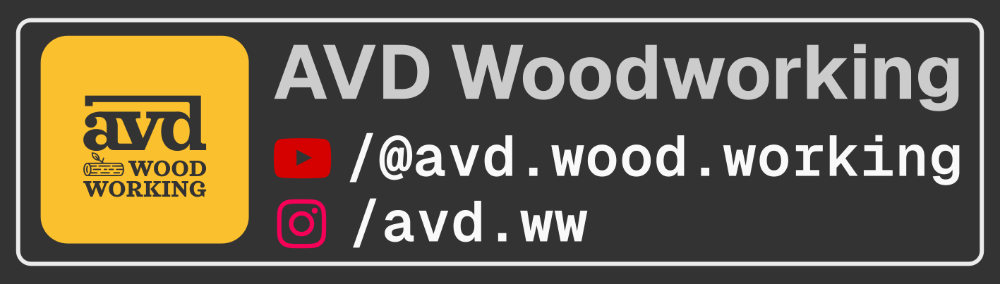

    

    

        <a href="https://www.youtube.com/@AVD.Wood.Working" target="_blank" rel="noopener" class="social-button youtube">
            <svg class="social-icon" viewBox="0 0 24 24">
                <path d="M10 16.5l6-4.5-6-4.5v9zM12 2C6.48 2 2 6.48 2 12s4.48 10 10 10 10-4.48 10-10S17.52 2 12 2zm0 18c-4.41 0-8-3.59-8-8s3.59-8 8-8 8 3.59 8 8-3.59 8-8 8z"/>
            </svg>
            YouTube Channel
        </a>
    

        <a href="https://www.instagram.com/avd.ww" target="_blank" rel="noopener" class="social-button instagram">
            <svg class="social-icon" viewBox="0 0 24 24">
                <path d="M7.8 2h8.4C19.4 2 22 4.6 22 7.8v8.4a5.8 5.8 0 0 1-5.8 5.8H7.8C4.6 22 2 19.4 2 16.2V7.8A5.8 5.8 0 0 1 7.8 2m-.2 2A3.6 3.6 0 0 0 4 7.6v8.8C4 18.39 5.61 20 7.6 20h8.8a3.6 3.6 0 0 0 3.6-3.6V7.6C20 5.61 18.39 4 16.4 4H7.6m9.65 1.5a1.25 1.25 0 0 1 1.25 1.25A1.25 1.25 0 0 1 17.25 8 1.25 1.25 0 0 1 16 6.75a1.25 1.25 0 0 1 1.25-1.25M12 7a5 5 0 0 1 5 5 5 5 0 0 1-5 5 5 5 0 0 1-5-5 5 5 0 0 1 5-5m0 2a3 3 0 0 0-3 3 3 3 0 0 0 3 3 3 3 0 0 0 3-3 3 3 0 0 0-3-3z"/>
            </svg>
            Instagram Profile
        </a>

 

---
### 16 April 2025 | An Invited Talk on Wood Working

Summary of the talk
My woodworking journey began in 2005, crafting furniture from scrap wood, evolving into a lifelong passion blending creativity, patience, and heritage. I taught wood basics (grain, hardwoods vs. softwoods), key tools (saws, chisels), 13 joinery techniques, and safety. Emphasized starting small, practicing, and viewing woodworking as a rewarding, evolving craft where dedication yields timeless creations.

  <embed src= "AVD_PDEU_Talk.pdf" width= "100%" height= "600px" type="application/pdf" >
