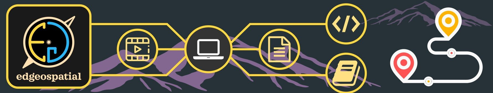

Collection of random data analysis, videos and links, I also have the youtube channel for this <a href="https://www.youtube.com/@edgeospatial"> @edgeospatial </a>

- 📬 | [Electoral-Bond Data Cleaning and Analysis with R-Programming](/post/2024-03-25-Electoral-Bond-Analysis/index.html)
- 🎞️ | [Catchment and stream network delineation with QGIS](https://youtu.be/pp6NX5lyx54?si=ue29wxxgHS8Qkmhm)
