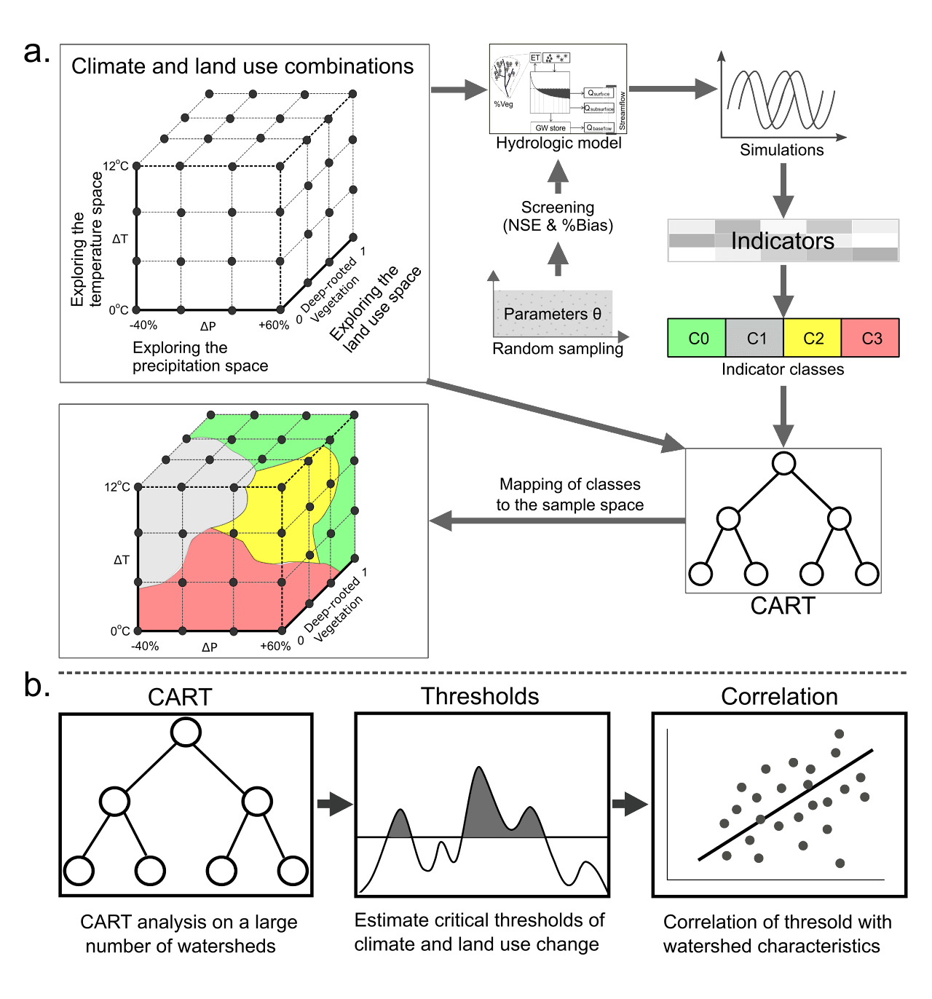
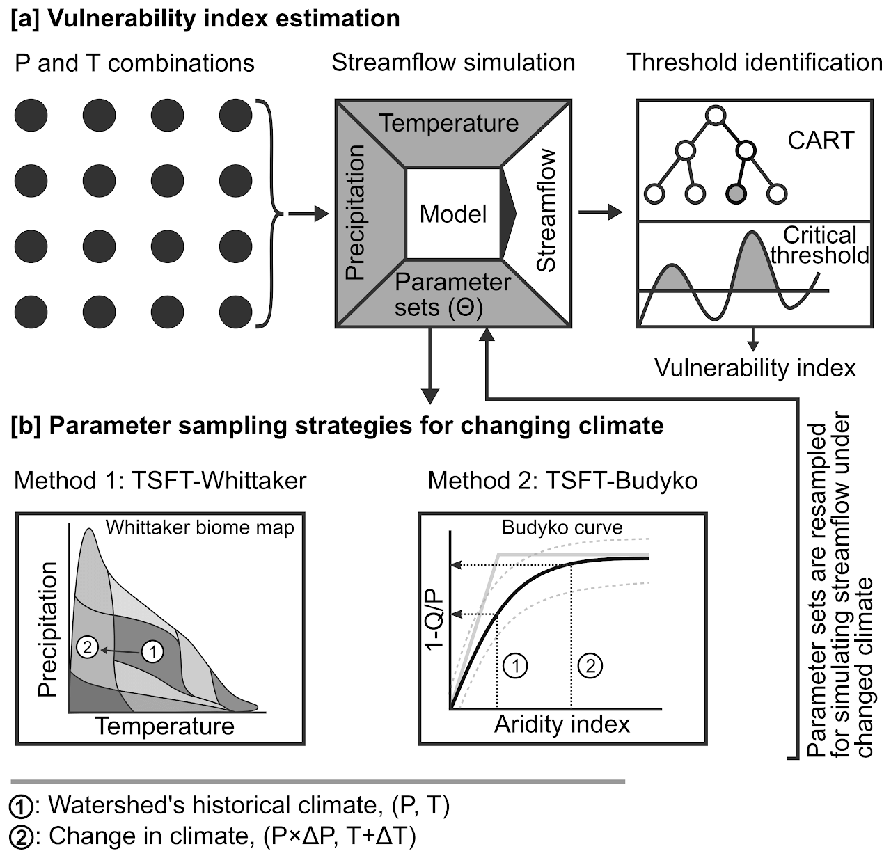
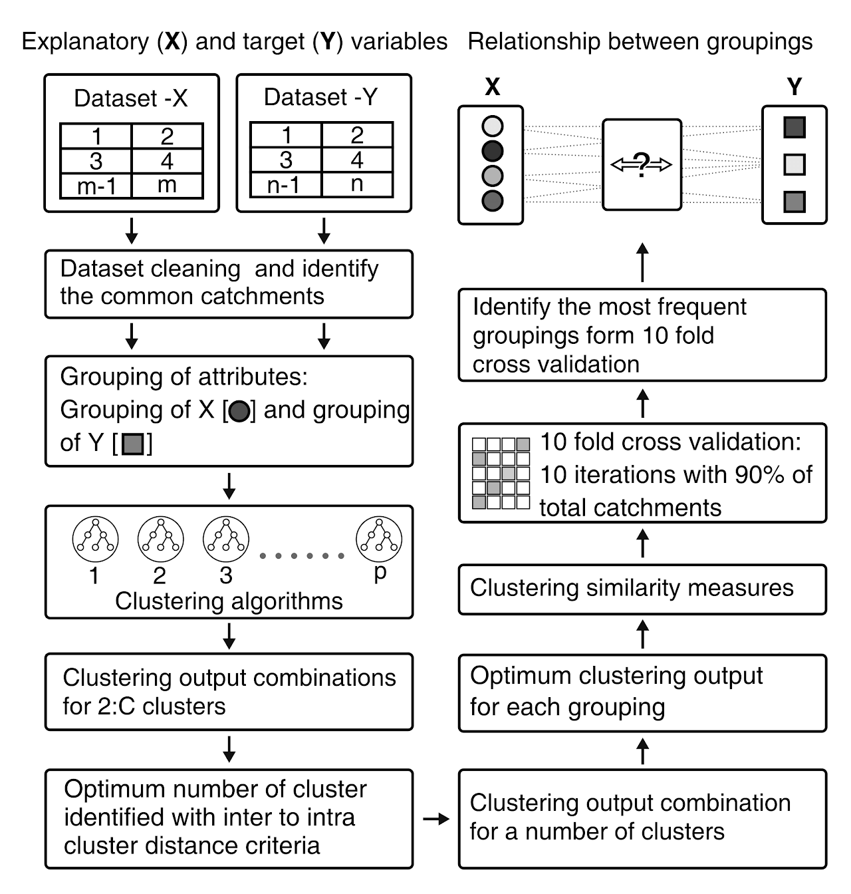

## Summary of my work presented in the following studies
### 1. Physio-climatic controls on vulnerability of watersheds to climate and land use change across the United States.
> - We combine the strengths of recently developed exploratory modeling frameworks and comparative hydrology to quantify the relationship between watershed’s vulnerability and its physio-climatic characteristics.
> - We propose a definition of vulnerability that can be used by a diverse range of water system managers and is useful in the presence of large uncertainties in drivers of environmental change.
> - We estimate the vulnerability of 69 watersheds in the United States to climate and land use change. 

  

---

### 2. A Whittaker-Biome based framework to account for the impact of climate change on catchment behavior

> - Rainfall-runoff models are often used to simulate the impact of long-term climate change on future water availability.
> - We compare estimates of catchment's vulnerability to climate change obtained from fixed and changing parameters. 
> - Our analysis shows that considering changes in catchment's representative parameters with climate significantly alters the estimated vulnerability to climate change for a majority of catchments.

  

---

### 3. Discovering linkages between catchment characteristics and hydrologic response within a catchment classification framework

> - Our main goals in this study was to develop a framework for classification that can be employed to standardize classification exercises in hydrology. 
> - We stress on two important aspects: the use of multiple classification methods and standardized performance metrics to gauge the success of a classification exercise.
> - We compare clustering based on water quality metrics and clustering based on catchment characteristics to identify combinations of catchment characteristics that best explain water quality variations. 
> - We prepare a comprehensive database for catchment characteristics for catchments across India and use it to understand regional drivers of water quality. 

  

---

## My current research is the best 
1. Drought monitoring 
2. Land use classification 

## Updates
> 23 July 2022 13:04

## Talks and Conference
01 November 2023
ICIWRM Conference Coimbatore
1. Updating ...

2. Updating ...

> 24 August 2022

- Mr. Vishal Rakhecha presented at the Innovation in Smart and Sustainable Infrastructure conference organized by Pandit Deendayal Energy University, Gandhinagar, from 23 to 25th August 2022. 

- Title of the talk: An enhanced bottom-up approach to assess the catchments' vulnerability to climate change.
