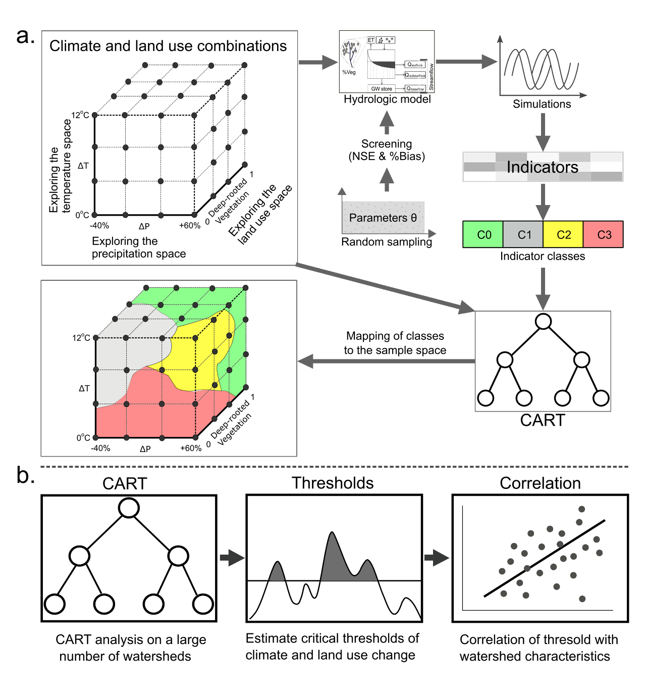
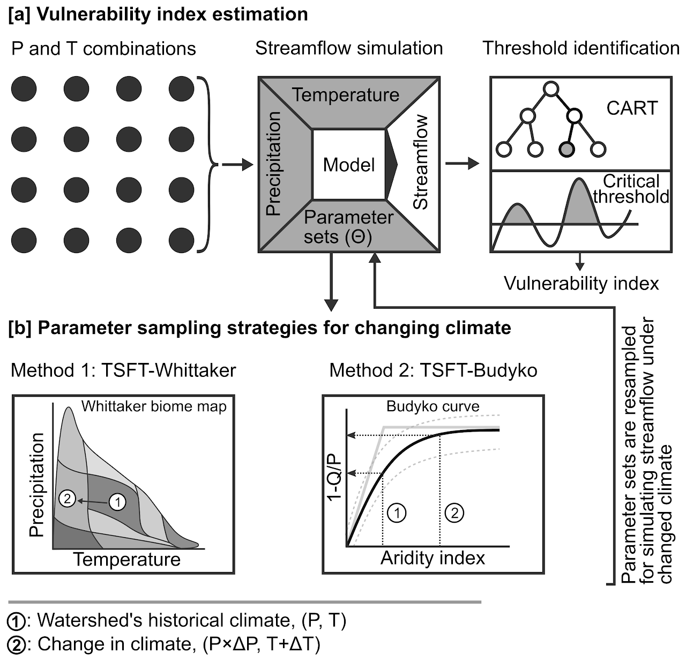
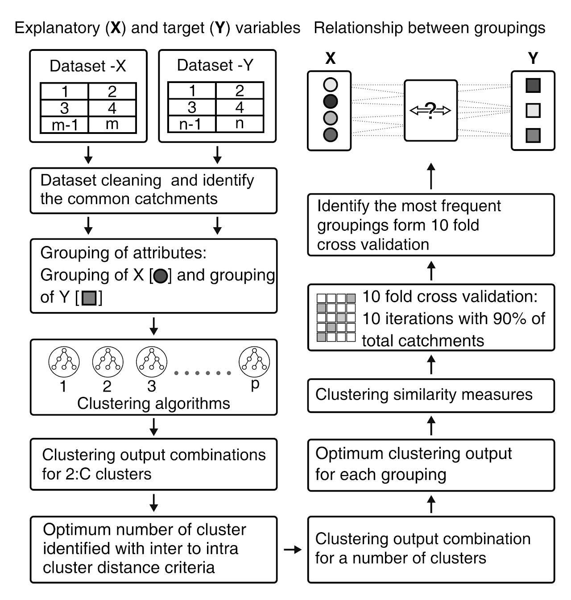

## Summary of my work presented in the following studies
### 1. Physio-climatic controls on vulnerability of watersheds to climate and land use change across the United States.
> Understanding how a watershed’s physio-climatic characteristics affect its vulnerability to environmental (climatic and land use) change is crucial for managing these complex systems. In this study, we combine the strengths of recently developed exploratory modeling frameworks and comparative hydrology to quantify the relationship between watershed’s vulnerability and its physio-climatic characteristics. We propose a definition of vulnerability that can be used by a diverse range of water system managers and is useful in the presence of large uncertainties in drivers of environmental change. This definition is related to adverse climate change and land use thresholds that are quantified using a recently developed exploratory modeling approach. In this way, we estimate the vulnerability of 69 watersheds in the United States to climate and land use change. We explore definitions of vulnerability that describe average or extreme flow conditions, as well as others that are relevant from the point of view of instream organisms. In order to understand the dominant controls on vulnerability, we correlate these indices with watershed’s characteristics describing its topography, geology, drainage, climate, and land use. We find that mean annual flow is more vulnerable to reductions in precipitation in watersheds with lower average soil permeability, lower baseflow index, lower forest cover, higher topographical wetness index, and vice-versa. Our results also indicate a potential mediation of climate change impacts by regional groundwater systems. By developing such relationships across a large range of watersheds, such information can potentially be used to assess the vulnerability of ungauged watersheds to uncertain environmental change.

  

Sub This is my text

### 2. A Whittaker-Biome based framework to account for the impact of climate change on catchment behavior

Rainfall-runoff models are often used to simulate the impact of long-term climate change on future water availability. A common assumption in most modeling frameworks is that catchment's hydrologically relevant characteristics, represented via model parameters, remain constant. However, several studies present evidence on the contrary and suggest potential biases in estimates of future streamflow due to this assumption. Regardless, there is a lack of modeling frameworks that account for the possible impact of climate on catchment's characteristics. To change model parameters with climate, we propose a method based on the Whittaker biome plot that relates biome type to the climatic setting of a catchment. We compare estimates of catchment's vulnerability to climate change obtained from fixed and changing parameters. Our analysis spanning 83 catchments across the conterminous United States, shows that considering changes in catchment's representative parameters with climate significantly alters the estimated vulnerability to climate change for a majority of catchments.

### 3. Discovering linkages between catchment characteristics and hydrologic response within a catchment classification framework

Our main goals in this study was to develop a framework for classification that can be employed to standardize classification exercises in hydrology. We stress on two important aspects: the use of multiple classification methods and standardized performance metrics to gauge the success of a classification exercise. There is a lack of general frameworks which employ multiple clustering techniques to come up with the most suitable classification. We compare clustering based on water quality metrics and clustering based on catchment characteristics to identify combinations of catchment characteristics that best explain water quality variations. We prepare a comprehensive database for catchment characteristics for catchments across India and use it to understand regional drivers of water quality. 

## My current research is the best 
1. Drought monitoring 
2. Land use classification 

## Updates
> 23 July 2022 13:04

## Talks and Conference
01 November 2023
ICIWRM Conference Coimbatore
1. Updating ...

2. Updating ...

> 24 August 2022

- Mr. Vishal Rakhecha presented at the Innovation in Smart and Sustainable Infrastructure conference organized by Pandit Deendayal Energy University, Gandhinagar, from 23 to 25th August 2022. 

- Title of the talk: An enhanced bottom-up approach to assess the catchments' vulnerability to climate change.
