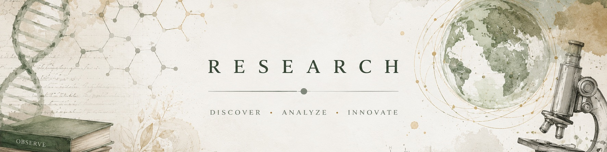
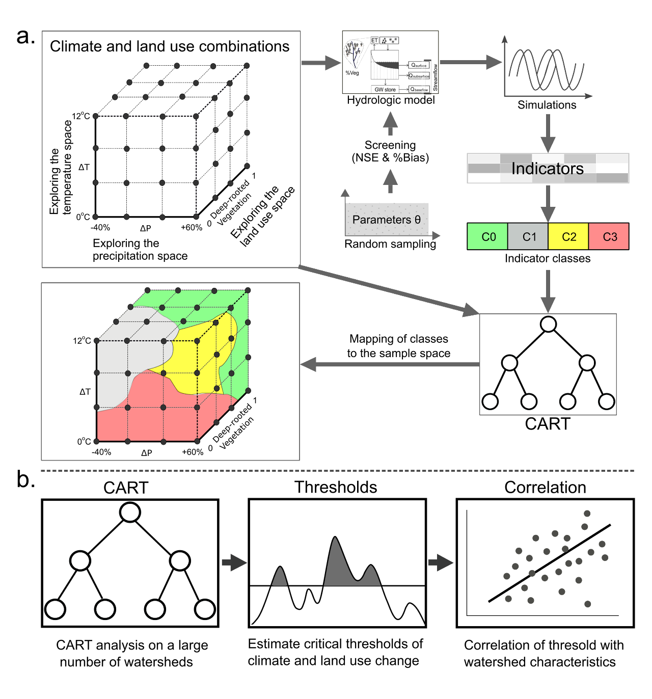
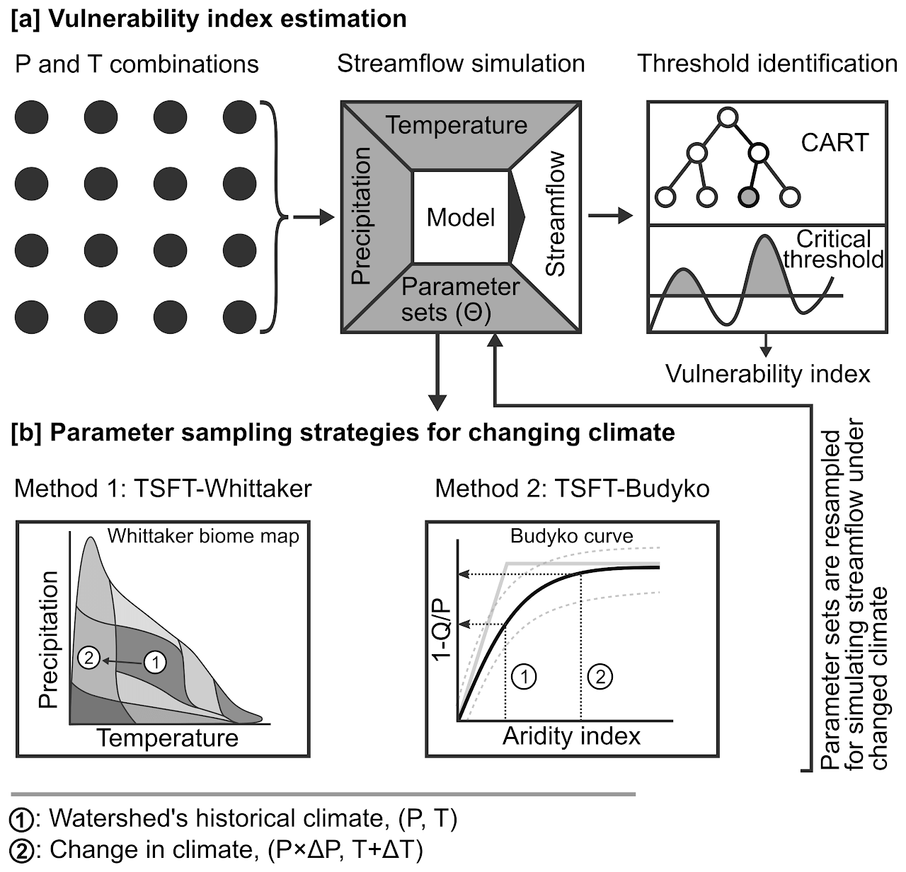
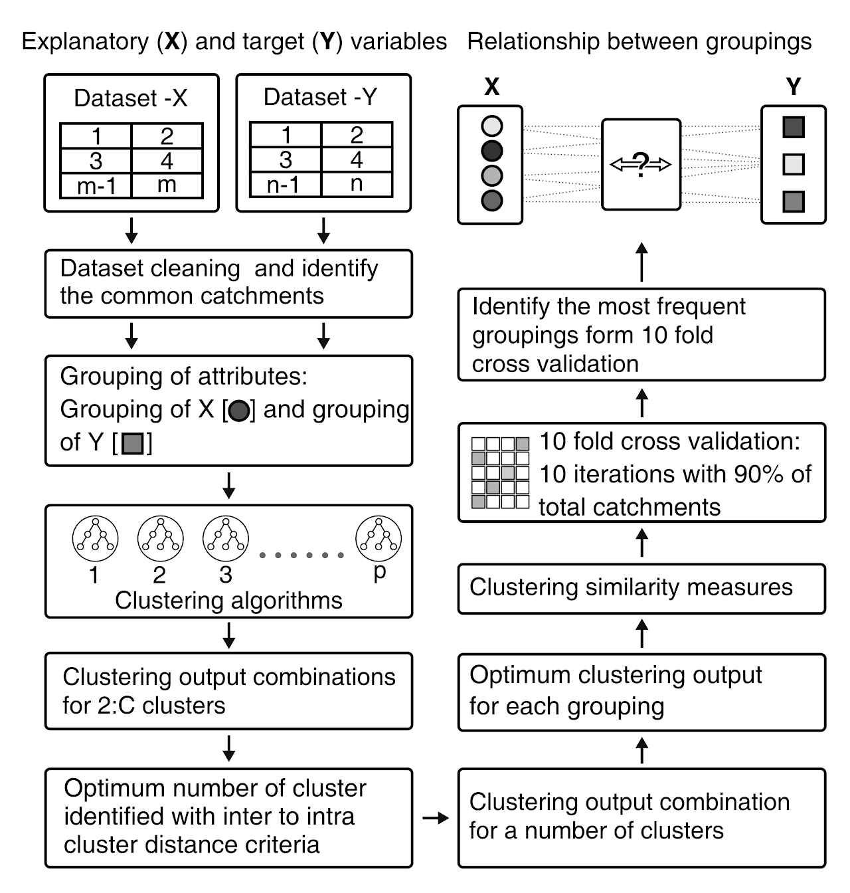

  <!-- Your image -->
  

  <!-- Social icons overlay -->
  

    
    
    
    
    
  

<h3>Research Interests</h3>

My research lies at the intersection of **computational hydrology, water resources engineering, geospatial analytics, and environmental change science**. I am particularly interested in understanding how climatic variability, land-use change, and anthropogenic interventions alter catchment-scale hydrological processes and water availability.

During my doctoral research, I developed methodologies for assessing **catchment vulnerability to environmental change**, with a focus on quantifying the sensitivity and resilience of river basins under changing hydro-climatic conditions. This work strengthened my interest in data-driven hydrological analysis and large-scale environmental assessment.

My current research focuses on developing a comprehensive **physio-climatic catchment characteristics database for the Indian subcontinent** to support hydrological prediction in ungauged basins (PUB), regionalization studies, drought assessment, and large-sample hydrology applications. I am also interested in understanding how climate variability, socio-economic development, and landscape alterations influence streamflow dynamics and catchment response.

My expertise includes **geospatial data processing, remote sensing, hydrological modeling, drought analysis, statistical computing, and reproducible environmental research**. I work extensively with R and open-source geospatial tools to develop scalable workflows for environmental data analysis and decision support. I actively seek interdisciplinary collaborations that combine hydrology, climate science, geospatial technologies, and data-driven modeling approaches.

---

## Current Research Topics

- Development of a physio-climatic catchment characteristics dataset for Indian river basins.
- Catchment vulnerability assessment under climate and environmental change.
- Prediction in ungauged basins using regionalization and machine learning approaches.
- Large-sample hydrology and comparative catchment analysis.
- Hydrological and agricultural drought monitoring, forecasting, and risk assessment.
- Impacts of climate variability and socio-economic development on streamflow response.
- Geospatial and remote sensing applications in water resources management.

---

## Skills

| Category             | Expertise                                                                                                                                                                        |
| -------------------- | -------------------------------------------------------------------------------------------------------------------------------------------------------------------------------- |
| **Research Areas**   | Computational Hydrology, Water Resources Engineering, Drought Analysis, Hydrological Modeling, Catchment Regionalization, Climate Change Impact Assessment, Geospatial Analytics |
| **Programming**      | R, Python, MATLAB                                                                                                                                                                |
| **Geospatial Tools** | QGIS, GDAL, Google Earth Engine (GEE)                                                                                                                                            |
| **R Ecosystem**      | tidyverse, terra, sf, stars, data.table, tidymodels, RMarkdown                                                                                                                   |
| **Data & Modeling**  | Statistical Analysis, Machine Learning, Hydrological Forecasting, Time-Series Analysis, Reproducible Research                                                                    |
| **Remote Sensing**   | Sentinel, Landsat, Climate Reanalysis Data, Geospatial Data Processing                                                                                                           |

<!-- Collapsible section: My work presented in the following studies (default collapsed) -->

<h3>Research Snippets</h3>

### 1. Physio-climatic controls on vulnerability of watersheds to climate and land use change across the United States.

> - We combine the strengths of recently developed exploratory modeling frameworks and comparative hydrology to quantify the relationship between watershed’s vulnerability and its physio-climatic characteristics.
> - We propose a definition of vulnerability that can be used by a diverse range of water system managers and is useful in the presence of large uncertainties in drivers of environmental change.
> - We estimate the vulnerability of 69 watersheds in the United States to climate and land use change.

  

---

### 2. A Whittaker-Biome based framework to account for the impact of climate change on catchment behavior

> - Rainfall-runoff models are often used to simulate the impact of long-term climate change on future water availability.
> - We compare estimates of catchment's vulnerability to climate change obtained from fixed and changing parameters.
> - Our analysis shows that considering changes in catchment's representative parameters with climate significantly alters the estimated vulnerability to climate change for a majority of catchments.

  

---

### 3. Discovering linkages between catchment characteristics and hydrologic response within a catchment classification framework

> - Our main goals in this study was to develop a framework for classification that can be employed to standardize classification exercises in hydrology.
> - We stress on two important aspects: the use of multiple classification methods and standardized performance metrics to gauge the success of a classification exercise.
> - We compare clustering based on water quality metrics and clustering based on catchment characteristics to identify combinations of catchment characteristics that best explain water quality variations.
> - We prepare a comprehensive database for catchment characteristics for catchments across India and use it to understand regional drivers of water quality.

  

<!-- Collapsible section: Publications (default collapsed) -->

<h3>Publications</h3>

### Peer Reviewed Articles

- Deshmukh, A., and Singh, R. (2019). A Whittaker‐Biome based framework to account for the impact of climate change on catchment behavior. Water Resources Research, In Press, doi: 10.1029/2018WR023113

- Deshmukh, A., and Singh, R. (2016). Physio-climatic controls on vulnerability of watersheds to climate and land use change across the United States. Water Resources Research, doi: 10.1002/2016WR019189

### Book Chapter

- Singh, R., Veena, S., and Deshmukh, A., 2017. Assessing the vulnerability of water avialabilty across India to climate change and interlinking of rivers. In, Sustainable Holistic Water Resources Management, Raju, S., and Vasan, A. (eds)., 2017, M/S Jain Brothers, New Delhi

### Conferences & Meetings

_\*\* presented by_

- Deshmukh, D., Singh\*\*, R., and Samal, A. Catchment classification: a tool to understand hydrology in data scarce regions. 15th Annual Meeting of the Asia Oceania Geosciences Society (AOGS), 03-08 June 2018, Honolulu, Hawaii.

- Deshmukh\*\*, A., and Singh, R., 2018. Identifying physio-climatic controls on watershed vulnerability to climate and land use change. International Soil and Water Assessment Tool Conference, 10-12 January 2018, Chennai, India

- Deshmukh\*\*, A., Samal, S., and Singh, R., 2017. Towards a robust framework for catchment classification. Fall Meeting of the American Geophysical Union, 11-15 December 2017, New Orleans, USA.

- Singh\*\*, R., and Deshmukh, A., 2015, December. What controls vulnerability of watersheds to climate and land use change across the United States? Fall meeting of the American Geophysical Union, 14-18 December 2015, San Francisco, USA

