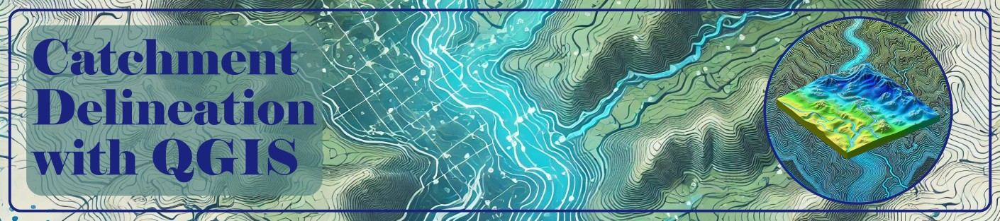

**Catchment Delineation: A Step-by-Step Guide for Effective Water Resource Management**

Understanding and managing water resources starts with analyzing catchments—the areas where rainfall collects and drains into a common outlet. In this blog, we break down the process of **catchment delineation**, a critical technique for hydrologists and environmental planners, using open-source tools like QGIS.

### **What is a Catchment?**
A catchment, or watershed, is a land area where all surface runoff converges to a single point, such as a river or lake. It serves as the fundamental unit for hydrological studies, helping predict water availability, flood risks, and ecosystem health.

### **Tools You’ll Need**
- **QGIS**: A free, open-source GIS software for spatial analysis.
- **DEM Data**: Digital Elevation Models (e.g., SRTM, ASTER GDEM) to map terrain.
- **Plugins**: SRTM-Downloader for fetching elevation data.

### **Step-by-Step Catchment Delineation Process**

#### **1. Acquire DEM Data**
- **Sources**: Use global datasets like NASA’s **30m SRTM** or JAXA’s **ALOS World 3D**.
- **Download**: Access tiles via [dwtkns.com/srtm30m](https://dwtkns.com/srtm30m) or QGIS plugins.

#### **2. Preprocess DEM**
- **Merge Tiles**: Combine multiple DEM tiles into a seamless raster (*Raster → Miscellaneous → Merge*).
- **Reproject**: Convert to a local coordinate system (e.g., UTM) for accurate area calculations (*Raster → Projections → Warp*).
- **Fill Sinks**: Correct depressions in the DEM to ensure proper flow modeling (*SAGA Terrain Analysis → Fill*).

#### **3. Derive Hydrological Features**
- **Flow Direction**: Calculate water movement using the **D8 algorithm**, which identifies the steepest downhill path for each cell.
- **Flow Accumulation**: Determine areas where water accumulates, forming streams. Apply thresholds (e.g., >3 cells) to define river networks.
- **Strahler Stream Order**: Classify streams hierarchically to prioritize major channels.

#### **4. Define Outflow & Delineate Catchment**
- **Set Outlet**: Mark the catchment’s drainage point on the stream network.
- **Upslope Area**: Use QGIS tools to automatically delineate the catchment boundary based on flow direction and accumulation.

#### **5. Analyze & Visualize**
- **Calculate Metrics**: Determine catchment area, perimeter, and stream length using QGIS’ *Field Calculator*.
- **Stylize Maps**: Apply colors, labels, and scales to create professional outputs for reports.

### **Why QGIS?**
- **Cost-Effective**: Free and open-source.
- **Cross-Platform**: Works on Windows, macOS, and Linux.
- **Community Support**: Extensive tutorials and plugins.

### **Key Takeaways**
1. Catchment delineation is foundational for flood modeling, drought assessment, and land-use planning.
2. Open-source tools like QGIS democratize access to advanced hydrological analysis.
3. Proper DEM preprocessing ensures accurate results—don’t skip sink-filling or reprojection!

**Ready to Start?**
Download QGIS, grab SRTM data, and follow the steps above to map your first catchment. For more resources, visit [Dr. Ankit Deshmukh’s website](www.ankitdeshmukh.com) or explore QGIS documentation.

*#QGIS #DEM #SRTM #CatchmentDelineation*

<embed src= "AMTWRE_AnkitDeshmukh.pdf" width= "100%" height= "600px" type="application/pdf" >
