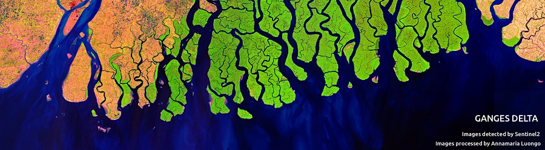

The collection of slide of the subject I teach to undergrauate students.

### Geospatial Techniques Introduction (A.Y: 2022-23)
- [Introduction and Handout](/Slides/20220722_Geospatial-Techniques/GA-W-01/Slides.html)

### Remote Sensing
- [Introduction of RS and GIS](/Slides/20220722_Geospatial-Techniques/GA-W-02/Slides.html)
- [Remote Sensing Resolutions](/Slides/20220722_Geospatial-Techniques/GA-W-03/Slides.html)
- [Digital Image Processing](/Slides/20220722_Geospatial-Techniques/GA-W-04/Slides.html)

### Geographical Information Systems
- [Introduction- Geographical Information Systems](/Slides/20220722_Geospatial-Techniques/GA-W-05/Slides.html)
