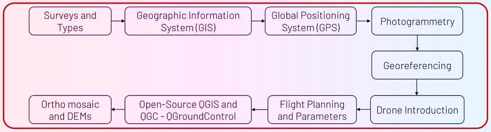

PDEU has successfully conducted one Day Skill development program on “High-Resolution UAV (Drone) and Hydrodynamic Modeling for Disaster Risk Reduction and Damage Assessment” for newly recruited more than 60 participants of Narmada Water Resources, Water Supply and Kalpsar Department (NWRWS&KP).

[LinkedIn post by HoD Civil PDEU](https://www.linkedin.com/posts/dr-dhruvesh-patel-33973551_pleasure-to-share-that-civil-engineering-activity-7136593572442611712-xdtQ?utm_source=share&utm_medium=member_desktop)

This is my talk regrading basic training of Drone based surveying, flight planning and GIS.

**#drone | #GIS**

<embed src= "20231201_Drone_Techniques_Introduction.pdf" width= "100%" height= "600px" type="application/pdf" >
