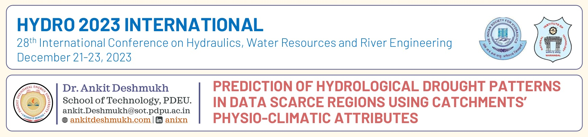

### Talk on "Prediction of hydrological drought patterns in data scarce regions using catchments’ physio-climatic attributes"

### I talked about 
- Climate change and water scarcity
- Current drought scenarios
- Relationship between Meteorological and hydrological drought
- Catchment characteristic to generalization drought pattern

### Key points 
fd

- We compute the relation between Hydrological and meteorological drought.
- Proposed the way to compute the lag between hydrological and meteorological drought.
- Framework to utilize the catchment characteristics for drought generalization of ungauged catchment.

**#drought #Hydro2023**

<embed src= "20231221_Hydro-2023.pdf" width= "100%" height= "600px" type="application/pdf" >
