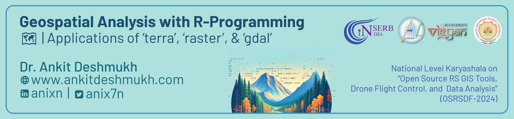

The slides from my recent talk "Geospatial analysis with R-Programming" presented at National Level Karyashala on "Open Source RS GIS Tools, Drone Flight Control, and  Data Analysis" (OSRSDF-2024). Dive into the world of #GeospatialAnalysis #GIS and #R with these insights and techniques that I've discussed. Perfect for anyone passionate about spatial data analysis!

- [Geospatial Analysis with R-Programming Slides ](/Slides/2024031_Geospatial_Analysis_with_R/SlidesFile/Slides.html)

**#GeoSpatialAnalysis | #GIS | #R**
