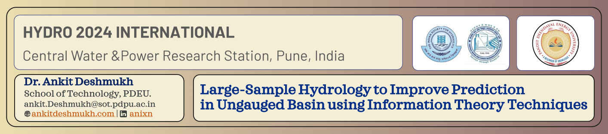

### Talk on "Large-Sample Hydrology to Improve Prediction in Ungauged Basins using Information Theory Techniques"
- The venue was CWPRS Pune
- Talk of the date is `20 December 2024`

### I talked about
1. Prediction in Ungauged Basins (PUB): PUB addresses the challenge of estimating hydrological behaviors, such as streamflow and runoff, in river basins where direct measurements are unavailable.
2. Trading Space for Time (TSFT) Approach: TSFT is a novel method utilizing data from multiple catchments to mitigate the impact of low parameter or discharge data availability.
3. Large-Sample Hydrology (LSH): LSH leverages extensive datasets across spatial and temporal scales to improve prediction models for ungauged basins.
4. Recent datasets like CAMELS and CARAVAN provide critical data for hypothesis testing and advancing regionalization techniques.

### Key points of talk
- Proposed the framework to group catchments to imporve the TSFT for better prediction.
- We use Purity, NMI methods to compare the clusterings.

*#LSH #PUB #TSFT #Hydro2024*

<embed src= "Slides_Hydro-2024.pdf" width= "100%" height= "600px" type="application/pdf" >
