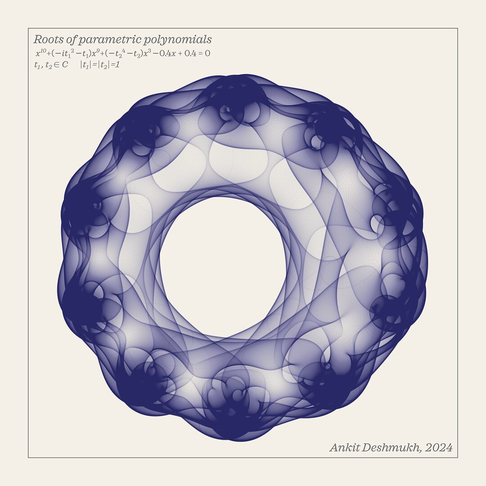

I use open source tools such as `Inkscape`, `GIMP` and `R` to create info-graphics, data visualization and generative art. Some example of my work showing Wordcloud, Hexagon grid, generative art, etc.

### Some artwork created with Inkscape:
<button style = "padding: 1px 10px"></button>
<button style = "padding: 1px 10px"></button>
<button style = "padding: 1px 10px"></button>
<button style = "padding: 1px 10px"></button>
<button style = "padding: 1px 10px"></button>
<button style = "padding: 1px 10px"></button>

---
### Generative art with R
**I use R programming to create generative arts:**

<button style = "padding: 1px 6px"></button>
<button style = "padding: 1px 6px"></button>
<button style = "padding: 1px 6px"></button>

**Generative art with Roots of Parametric Polynomials:**

<button style = "padding: 1px 6px"></button>
<button style = "padding: 1px 6px"></button>
<button style = "padding: 1px 6px"></button>
