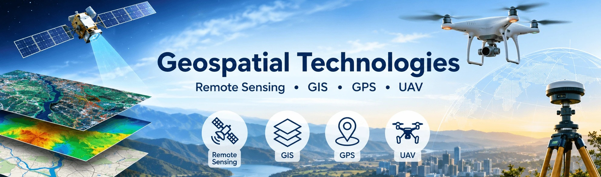

The collection of slide of the subject I teach to undergraduate students.

**S0:** <a href="https://anixn.github.io/slides/202207_gs_tech/GA/Slides_1.html" target="_blank" rel="noopener noreferrer">Introduction and Handout</a>

**S1:** <a href="https://anixn.github.io/slides/202207_gs_tech/GA/Slides_2.html" target="_blank" rel="noopener noreferrer">Basics of Remote Sensing</a>

**S2:** <a href="https://anixn.github.io/slides/202207_gs_tech/GA/Slides_3.html" target="_blank" rel="noopener noreferrer">Remote sensing resolutions</a>

**S3:** <a href="https://anixn.github.io/slides/202207_gs_tech/GA/Slides_4.html" target="_blank" rel="noopener noreferrer">Digital Image processing</a>

**S4:** <a href="https://anixn.github.io/slides/202207_gs_tech/GA/Slides_5.html" target="_blank" rel="noopener noreferrer">Introduction to Geographical information systems</a>
