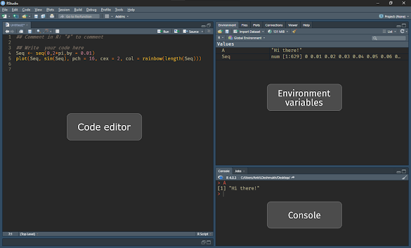
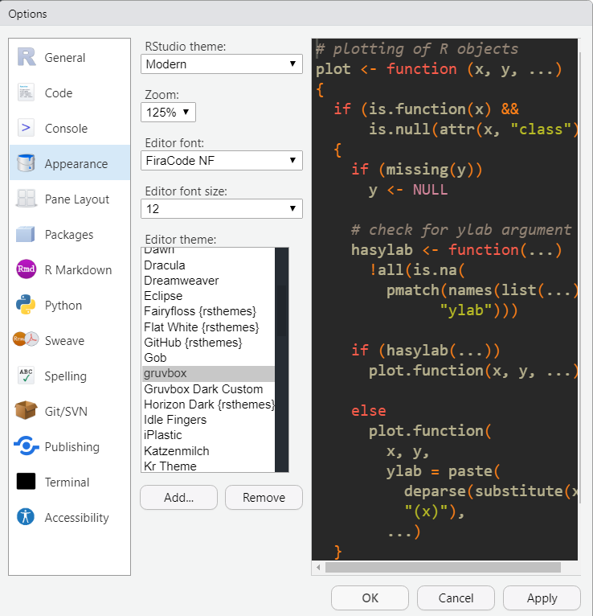
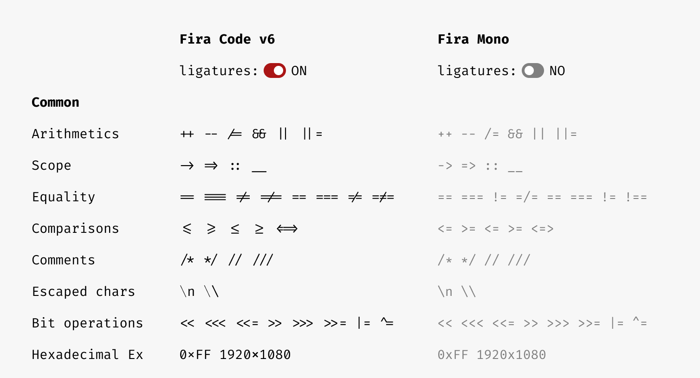
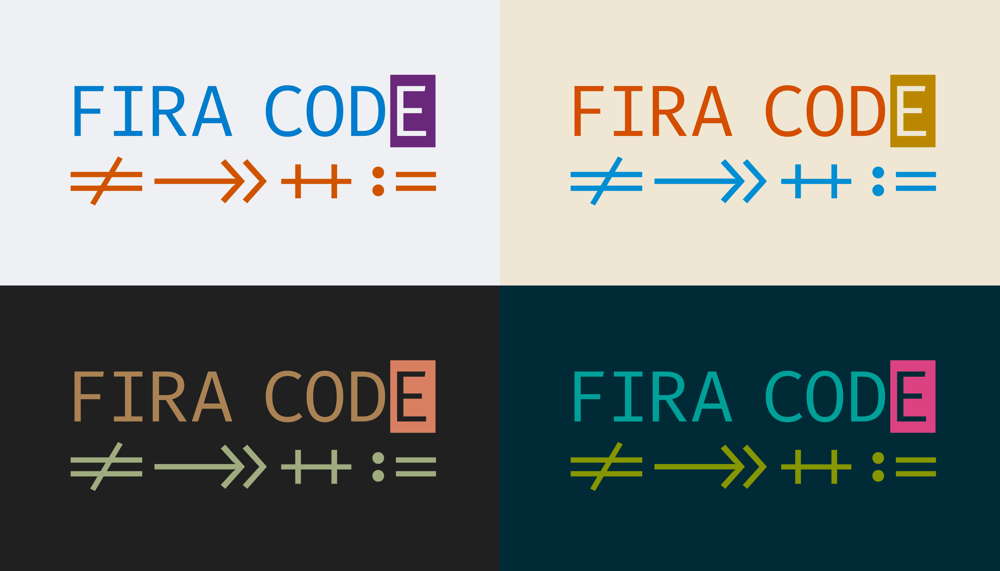
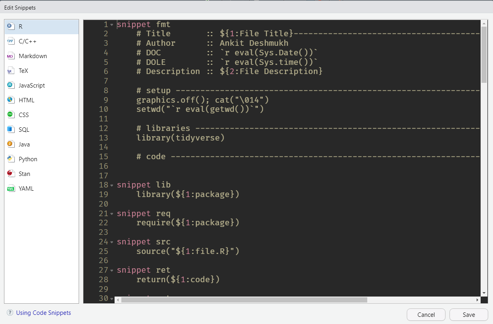

[R](https://www.r-project.org/) is a very versatile statistical tool and programming language. It's my all-time good-to-go data analysis tool. It is fast, reliable and nifty. It provides great flexibility for my daily work and analysis tasks. If one uses R, they could consider [RStudio](https://www.rstudio.com/) as a more sophisticated GUI than the Base R once.


## 1. Installing R
Step 01: Install R-Binaries from R-Project

Step 02: Install RStudio IDE from RStudio

## 2. Customizing RStudio
A lot of ways you can make RStudio more useful for your personal use. Like updating your '.RProfile', adding an awesome theme, and fonts that support ligatures.

- **Using Rstudio as R-IDE:** R studio has multiple windows but the most important are Code editor, console, Environment variable pane, and plot output pane.

<div class="figure">

<p class="caption">(\#fig:unnamed-chunk-1)R-Studio IDE have many pans.</p>
</div>

- **Code editor:** You will write your code in this window. R used `#` as the comment character.  To assign a variable to a value we use `←` (lowercase followed by a dash).


### 2.1 Customize R startup with ".Rprofile"
If you are using a Windows machine you can find the location of your '.Rprofile' at 'C:/Users/UserName/Documents'. The code block is shown below. This is what my '.Rprofile' looks like. Several costume functions can be added here and they will load with R startup every time.

```r
cat("\014")
cat("Hi Ankit! What are we doing today?\n")
```

<div class="figure">

<p class="caption">(\#fig:unnamed-chunk-3)A RStudio window</p>
</div>


### 2.2 Adding a theme
I personally like the dark theme for my R studio. I particularly like to use the ['Gruvbox'](https://github.com/morhetz/gruvbox) theme that is not available in RStudio but can be downloaded from [here](https://www.filehosting.org/file/details/963261/gruvbox.rstheme). Download the file and paste it to `'C:\Users\UserName\AppData\Roaming\RStudio\themes'`. To apply the theme in R studio go to `Tools > Global Option > Appearance` and select editor theme as gruvbox.


<div class="figure">

<p class="caption">(\#fig:unnamed-chunk-4)RSudio configuration windows</p>
</div>


### 2.3 Adding fonts that support ligature
This helps to read and understand code faster and efficiently, mostly the merged common occurring 2 characters to one for easy reading but this is just a font rendering feature it means the underlying code remains ASCII-compatible [[Source]](https://github.com/ryanoasis).


<div class="figure">

<p class="caption">(\#fig:wi)Font Ligature makes code more asthetic pleasing and readable</p>
</div>


Fira Code is a free monospaced font containing ligatures for common programming multi-character combinations.

<div class="figure">

<p class="caption">(\#fig:unnamed-chunk-5)Fira Font with different themes</p>
</div>

Download and FiraCode font from [Here](https://github.com/tonsky/FiraCode/releases/download/5.2/Fira_Code_v5.2.zip), and Install on your machine for all users. To apply the theme in R studio go to `Tools > Global Option > Appearance` and select editor font as **Fira Code**.

## 3. Customize R with code snippets
The snippet is a re-usable piece of code or text. Ordinarily, these are formally defined operative units to incorporate into larger programming modules. To repeat a few operations and formats you can use snippets in R. To edit or add snippets in RStudio go to `Tools > Global Option > Code > Editing`, now enable Snippets and click edit snippets.


<div class="figure">

<p class="caption">(\#fig:unnamed-chunk-6)R Snippets for quick code chunks.</p>
</div>

From the edit snippets window you can manage snippets of R. Mostly I use R and R markdown snippets in my daily use. Few useful snippets are:


``` r
snippet cls
  graphics.off(); rm(list = ls()); cat("\014")

snippet rqr
  if(!require(${1:packageName})){install.packages("${1:packageName}");
  library(${1:packageName})}

snippet fmt
	# Title       :: ${1:File Title}------------------------------------------------
	# Author      :: Ankit Deshmukh
	# DOC         :: `r eval(Sys.Date())`
	# DOLE        :: `r eval(Sys.time())`
	# Description :: ${2:File Description}

	# setup ------------------------------------------------------------------------
	graphics.off(); cat("\014")
	setwd("`r eval(getwd())`")

	# libraries --------------------------------------------------------------------
	library(tidyverse)

	# code -------------------------------------------------------------------------

snippet pp
  "`r gsub("\\\\", "/", readClipboard())`"

snippet clear
  rm(list = ls()); graphics.off();cat("\014")
```
To use the snippet use the keywords such as **clear** and press `Shift + Tab` to auto complete the snippet text.
