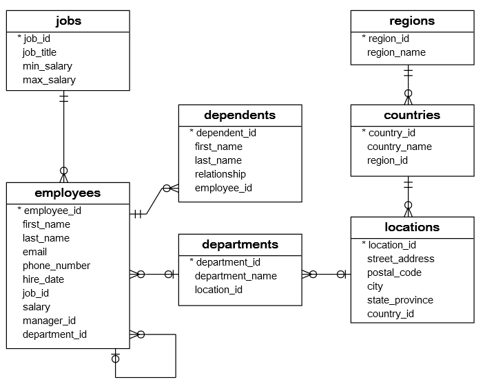

```{r setup, include=FALSE}
knitr::opts_chunk$set(message = FALSE, warning = FALSE, collapse = TRUE)
```

## What is PostGIS and why PostGIS is benificial over tredtional analysis approaches.
PostGIS is a spatial database extension for PostgreSQL that allows users to store and manipulate geospatial data. PostGIS has several advantages over the traditional approach of geospatial analysis, such as:

- PostGIS supports a wide range of spatial data types, functions, and operators, enabling complex spatial queries and operations.
- PostGIS integrates well with other GIS tools and frameworks, such as QGIS, GeoServer, and Leaflet, allowing users to visualize and analyze their data in different ways.
- PostGIS leverages the power and scalability of PostgreSQL, which is a robust, open-source, and widely used relational database management system.
- PostGIS enables spatial data analysis on large datasets, as it can handle millions of features and perform spatial joins and aggregations efficiently.
- PostGIS facilitates data sharing and collaboration, as it allows multiple users to access and modify the same spatial data concurrently.

## PostGIS for Professionals
The PostGIS roadmap is crucial for professionals in the field of GIS, Water resources, and Hydrology. To grow in the field of GIS expert you must to the certain taks on regular basis: 

1. **Master Core PostGIS Functions:**
   - Ensure a solid understanding of fundamental PostGIS functions for spatial data handling.
   - Proficiency in spatial queries, geometric operations, and indexing techniques is essential.

2. **Deepen Geospatial Database Skills:**
   - Expand your expertise in geospatial database management, including performance tuning and optimization strategies.
   - Familiarize yourself with advanced database concepts relevant to spatial data storage.

3. **Integration with GIS Software:**
   - Explore integration possibilities with popular GIS software like QGIS and ArcGIS to enhance your interoperability skills.
   - Stay informed about evolving standards and best practices in the GIS industry.

4. **Advanced Spatial Analytics:**
   - Focus on advanced spatial analytics using PostGIS, such as spatial regression analysis, network analysis, and 3D spatial operations.
   - Incorporate machine learning algorithms into spatial analysis to address contemporary challenges in water resources and hydrology.

5. **Open Source Contributions:**
   - Consider contributing to the PostGIS project or related open-source GIS projects. This enhances your visibility in the community and deepens your understanding of the system.

6. **Networking and Professional Development:**
   - Attend conferences, workshops, and webinars focused on geospatial technologies and PostGIS.
   - Engage with professionals in your field, both online and offline, to build a strong professional network.

7. **Certifications and Academic Collaborations:**
    - Pursue relevant certifications in GIS and spatial databases to validate your expertise.
    - Collaborate with academic institutions on research projects to stay at the forefront of advancements in hydrology, remote sensing, and GIS.

By systematically progressing through these steps, you'll be a highly skilled professional in PostGIS, well-equipped to tackle complex challenges in water resources and hydrology, and ultimately increase your attractiveness for high-paying job opportunities. 

Now we will understand how to setup PostGIS with QGIS in a Windows machine. 


## Quick installation
Install the PostgreSQL from the link [🔗](https://www.enterprisedb.com/downloads/postgres-postgresql-downloads)

- Install with default setting. Default port is 5432, change to something else if you have another version of PostgreSQL installed. 
- YouTube link https://www.youtube.com/watch?v=IYHx0ovvxPs 

### Connect a database with QGIS


## Basic of Structured Query Language (SQL) 
> SQL stands for Structured Query Language and is a domain-specific language for managing data in relational databases. SQL was originally developed by IBM in the 1970s and later standardized by ANSI and ISO. SQL allows users to query, manipulate, and control data using keywords, clauses, expressions, and statements that resemble natural language.

### Learning the basics of SQL
- Use tutorial and data from: <https://www.sqltutorial.org/sql-sample-database/>

- Creating [a SQL Sample Database](https://www.sqltutorial.org/wp-content/uploads/2020/04/postgresql-data.txt)

- The following database diagram illustrates the HR sample database


- This database has 7 tables, row numbers are shown in the table below
```{txt}
   | Table       | Rows |
   ----------------------
   | employees   | 40   |
   | dependents  | 30   |
   | departments | 11   |
   | jobs        | 11   |
   | locations   | 07   |
   | countries   | 25   |
   | regions     | 04   |
```
- The following script creates the HR sample [Database Structure in PostgreSQL](https://www.sqltutorial.org/wp-content/uploads/2020/04/postgresql.txt)

### Creating a Database: 
```sql
CREATE DATABASE test_db
    WITH
    OWNER = postgres
    ENCODING = 'UTF8'
    LOCALE_PROVIDER = 'libc'
    CONNECTION LIMIT = -1
    IS_TEMPLATE = False;
```

### List all the database and select the one
```cmd
postgres=# \l

postgres=# \c DATABASE_NAME
```
### Run the following to add PostGIS extension to Postgres

```cmd
CREATE EXTENSION postgis;
CREATE EXTENSION postgis_raster;
```

### Import shapefile in PostGIS
Use DB manager form QGIS

### Import raster in a database  
```cmd
raster2pgsql -s [SRID] -I -M [raster data source] -F [schema.table_name] | psql -U [username] -d [database name] -p [port] -h [host]
```
Example: 
```cmd
raster2pgsql -s 4326 -I -M Your_file.tif -F | psql -U postgres -d post_gis_v1 -p 5432 -h localhost
```


```sql

SELECT ST_X(ST_Centroid(geom)) AS long, ST_Y(ST_Centroid(geom)) AS lat FROM "ST_India-Dist";
```
```sql
SELECT ST_Centroid(geom) AS geom, gid, st_nm FROM "ST_India-Dist";
```


