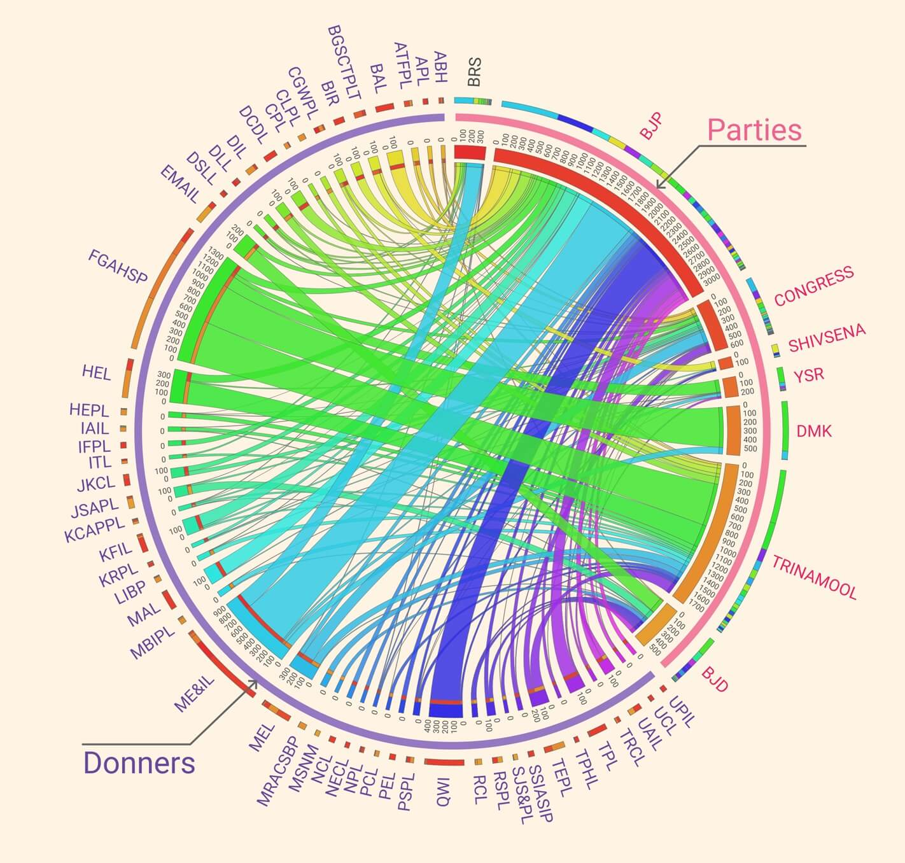

```{r setup, include=FALSE}
knitr::opts_chunk$set(message = FALSE, warning = FALSE, collapse = TRUE)
```

SBI Submits all the data to ECI and ECI publish it on `Thursday 21 Mar 2024, 6:32 PM` Links of 2 files are provided here: 

[Disclosure of Electoral Bonds](https://www.eci.gov.in/disclosure-of-electoral-bonds)

- [Details of Electoral Bonds submitted by SBI on 21st March 2024 (EB_Redemption_Details)](https://www.eci.gov.in/eci-backend/public/api/download?url=LMAhAK6sOPBp%2FNFF0iRfXbEB1EVSLT41NNLRjYNJJP1KivrUxbfqkDatmHy12e%2FzBiU51zPFZI5qMtjV1qgjFmSC%2FSz9GPIId9Zlf4WX9G%2BbMQG4kb31sE0S7b31iev056VRYj06iIsFTelbq233Uw%3D%3D)

- [Details of Electoral Bonds submitted by SBI on 21st March 2024 (EB_Purchase_Details)](https://www.eci.gov.in/eci-backend/public/api/download?url=LMAhAK6sOPBp%2FNFF0iRfXbEB1EVSLT41NNLRjYNJJP1KivrUxbfqkDatmHy12e%2FzBiU51zPFZI5qMtjV1qgjFmSC%2FSz9GPIId9Zlf4WX9G%2FfwrEDQFGDuen%2FyU1C5gVqkKaRPDqHSBCdx74poKJJ7Q%3D%3D)

To know the background of the case read this: [SBI submits all electoral bond details, including unique numbers, to ECI](https://www.business-standard.com/india-news/submitted-details-of-electoral-bonds-including-unique-code-to-ec-sbi-124032100933_1.html)

### A short note on regex`regex`
**regex**, short for Regular Expressions, are essentially sequences of characters that form a search pattern, which is then used to match strings or parts of strings in a text. Think of them as sophisticated search queries that allow you to find specific patterns within a larger body of text. regex can be used for simple patterns like a specific word or phrase, or you can create complex patterns to match more intricate structures such as email addresses, URLs, dates, and more.

For example, if you wanted to find all email addresses in a text document, you could use a regular expression pattern like `[a-zA-Z0-9_.+-]+@[a-zA-Z0-9-]+\\\\.[a-zA-Z0-9-.]+`. This pattern breaks down as follows:

```{r}
# Sample emails
em1 <- "example-1_Random@gmail.com" # this is a valid email
em2 <- "example*1_Random$gmail.com" # this is an invalid email. 

# Detect email addresses
stringr::str_detect(c(em1, em2), "[a-zA-Z0-9_.+-]+@[a-zA-Z0-9.-]+\\.[a-zA-Z0-9-.]+")
```

**a-zA-Z0-9_.+-]+** matches one or more alphanumeric characters, dots, underscores, percent signs, plus signs, or hyphens, representing the username portion of an email address.

$\textbf{@}$ matches the “@” symbol, separating the username from the domain.

**[A-Za-z0-9.-]+** matches one or more alphanumeric characters, dots, or hyphens, representing the domain name.

**\\.** matches a literal dot, separating the domain from the top-level domain.

**[a-zA-Z0-9-.]+** matches two or more alphabetic characters, representing the top-level domain (e.g., com, org, net).

Regular expressions can be used in various programming languages, here we are using it with R programming with `stringr` package.

### Required R libraries for this analysis
```{r}
# To process the PDF document 
if(!require(lubridate)){install.packages("lubridate");library(lubridate)}
if(!require(pdftools)){install.packages("pdftools");library(pdftools)}
if(!require(stringr)){install.packages("stringr");library(stringr)}
if(!require(readxl)){install.packages("readxl");library(readxl)}
if(!require(DT)){install.packages("DT");library(DT)}
```

```{r, include=TRUE, echo=FALSE, fig.align='center', fig.cap="Structure of the files in working directory"}
knitr::include_graphics("./Images/Tree.png", error = FALSE)
```

## Cleaning the Party data
We starting with reading the file `Parties.pdf` from `./Data/Raw Data/` directory. The regular expression [\\r\\n]+ is used to match one or more occurrences of either a carriage return (\r) or a newline character (\n). After that `str_trip` remove space either from starting or end of the each string. `str_split_fixed` split string with `"\\s{2,}"` means 2 consiqutive space till it reaches 9 element. We choose 9 because there are total 9 column in `Parties.pdf`. 

```{r}
Party <- pdf_text("./Data/Raw Data/Parties.pdf")
Party <- unlist(str_split(Party, "[\\r\\n]+"))
Party <- as.data.frame(str_split_fixed(str_trim(Party), "\\s{2,}", n = 9))

head(Party,5)
```

Upon inspection we find all the pages of pdf as the table header and now we are removing the headers, I remove row containing "Date of", "Sr No.", "Encashment" using V1 column.

After that we have Page.and it's numbers for each pages read by pdftools. We remove using `str_extract`, here Page{dash} represent anything after Page must be selected. We also remove rows that have all the columns emptly.

```{r}
Index = Party$V1 %in% c("Date of", "Sr No.", "Encashment")
Party <- Party[!Index,]

Index2 = is.na(str_extract(Party$V1, "Page."))
Party <- Party[Index2,];
Party <- Party[!apply(Party == "", 1, all),]

rm(Index, Index2)
```

Now, all the data is stored in the `Party` variable the structure of it.

```{r}
class(Party)
dim(Party)
```

We found at some row total number of columns are greater then 9. So before constructing the final data frame we choose checking each row with `for` loop. We pre-poulated several columns such as `SN`, `Date of Enchashment` 

```{r, eval=FALSE}
n = rep(NA,dim(Party)[1])

Index_m <- !nchar(Party$V9)>0
Col1 = as.data.frame(str_split_fixed(Party$V2, pattern = " ", n = 2))

Party_Data <- data.frame("SN" = as.numeric(Party$V1),
                         "Date of Encashment" = lubridate::dmy(Col1$V1),
                         "Party Name" = n,
                         "Account No" = n,
                         "Prefix" = n,
                         "Bond No" = n,
                         "Denominations" = n,
                         "Pay Branch Code" = n,
                         "Pay Teller" = n)
col7_t <- as.numeric(gsub(",", "", Party$V6))
col7_f <- as.numeric(gsub(",", "", Party$V7))


for(ii in seq_along(n)){
    if (Index_m[ii]) {
        Party_Data[ii,3] <- Col1$V2[ii]
        Party_Data[ii,4] <- Party$V3[ii]
        Party_Data[ii,5] <- Party$V4[ii]
        Party_Data[ii,6] <- as.numeric(Party$V5)[ii]
        Party_Data[ii,7] <- col7_t[ii]
        Party_Data[ii,8] <- Party$V7[ii]
        Party_Data[ii,9] <- as.numeric(Party$V8)[ii]
    } else {
        Party_Data[ii,3] <- Party$V3[ii]
        Party_Data[ii,4] <- Party$V4[ii]
        Party_Data[ii,5] <- Party$V5[ii]
        Party_Data[ii,6] <- as.numeric(Party$V6)[ii]
        Party_Data[ii,7] <- col7_f[ii]
        Party_Data[ii,8] <- Party$V8[ii]
        Party_Data[ii,9] <- as.numeric(Party$V9)[ii]
    }
    # print(ii) # running this might take some time. 
    # IMP: don't run white building the site.
}
```

Now, we have table similar to pdf, but I want to create unique id `un_id` by merging Perfiex with Bond No., so that I can match Parties to Donner, after that I save the data into `Party_Cleaned.xlsx` file.

```{r, eval=FALSE}
un_id= paste0(Party_Data$Prefix,
              str_pad(Party_Data$Bond.No, width = 5,pad = "0"))
Party_Data$unique_ID <- un_id
write.xlsx(Party_Data, file="./Data/Processed xlsx/Party_Cleaned.xlsx", row.names = FALSE)
```

Now to time to generate some table data, I am aggregation Party and Denominations data for table. To aggregate the data with Party name `aggregate` function from base R is used. After that `DT::datatable` is used for interactive table. 


```{r}
Party_Data <- read_xlsx(path = "./Data/Processed xlsx/Party_Cleaned.xlsx")

fx_name <- function(x) {c(length(x), median(x), round(mean(x),0), sum(x))}
agg_data = aggregate(Party_Data, Denominations ~ Party.Name, FUN = fx_name)

agg_data_df <- data.frame("Purchaser" = agg_data$Party.Name,
                          "Count" = agg_data$Denominations[,1],
                          "Median" = agg_data$Denominations[,2],
                          "Mean" = agg_data$Denominations[,3],
                          "Sum" = agg_data$Denominations[,4])

datatable(agg_data_df, options = list(
    initComplete = JS(
        "function(settings, json) {",
        "$(this.api().table().header()).css({'background-color': '#fff', 'color': '#111'});",
        "$(this.api().table().container()).css({'background-color': '#fff', 'color': '#111'});",
        "$(this.api().table().body()).css({'background-color': '#fff', 'color': '#111'});",
        "}")))%>% formatCurrency(c('Median', 'Mean', 'Sum'),
                                 currency = "₹",
                                 interval = 3,
                                 mark = ",",
                                 digits = 0)
```

## Cleaning the Donner data

Similar to the Party data, explore the Donner data from the pdf "Company.pdf" in the folder `Data/Raw Data`. Similar processing methodology is use as Party.pdf with one change this time total number of columns are 12.

```{r}
Comp <- pdf_text("./Data/Raw Data/Company.pdf")
Comp <- unlist(str_split(Comp, "[\\r\\n]+"))
Comp <- str_trim(gsub(",","",Comp))
```

Based on the data format, I found breaking it from as digit followed by space `(?<=\\d )` is more useful.

```{r}
Comp = as.data.frame(str_split_fixed(Comp, "(?<=\\d )", n = 12))
```

This will break the string the string in 2 columns, "SN", and "Reference No URN"

```{r}
a <- gsub("\\s+", " ", Comp$V1, perl = TRUE)

Index = a %in% c(a[1:3])
Comp <- Comp[!Index,]

Index2 = is.na(str_extract(Comp$V1, "Page."))
Comp <- Comp[Index2,]
Comp <- Comp[!apply(Comp == "", 1, all),]

rm(Index, Index2, a)
```
Now we will break down column V6 that has structure of  

"A B C INDIA LIMITED   TL       11448 " <br />

First we will crop Bond numbers using `str_sub` with 1 to -6 (6th character from the last) save in `c`. After that `Name`s are extracted using `c` removing last to charcter that are Prefix of the Unitq bond number. At last `Prefix` are extraced using `str_sub(c, -2, -1)`.

```{r}
BondN <- as.numeric(str_sub(str_trim(Comp$V6), -6,-1))

# you cans simply choose last 4 digit of the V6
c = str_trim(str_sub(str_trim(Comp$V6),1,-6))
Name <- str_trim(str_sub(c,1,-3))
Prefix <- str_sub(c, -2, -1)
```
Now we will assemble the data in the total 12 column. 

```{r}
Comp_Data <- data.frame("SN" = as.numeric(Comp$V1),
                        "Reference No URN" = str_trim(Comp$V2),
                        "Journal Date" = dmy(Comp$V3),
                        "Date of Purchase" = dmy(Comp$V4),
                        "Date of Expiry" = dmy(Comp$V5),
                        "Purchaser" = Name,
                        "Prefix" = Prefix,
                        "Bond No" = BondN,
                        "Denominations" = as.numeric(str_trim(Comp$V7)),
                        "Issue Branch Code" = str_trim(Comp$V8),
                        "Issue Teller" = as.numeric(str_trim(Comp$V9)),
                        "Status" = str_trim(Comp$V10))

# write.xlsx(Comp_Data, file="Comp_Cleaned.xlsx", row.names = FALSE)
```

We temporarily saved the files with "Comp_Cleaned.xlsx" and found there are some error in the columns, modify them here for one Donner. 

```{r, eval=FALSE}
Index = Comp_Data$Reference.No.URN %in% c("00300202310100000003344",
                                          "00300202310120000003422",
                                          "00300202310130000003470")
Comp_Data$Purchaser[Index] <- "L7 HITECH PRIVATE LIMITED"
Comp_Data$Denominations[Index] <- 10000000
Comp_Data$Issue.Branch.Code[Index] <- "00300"
Comp_Data$Prefix[Index] <- "OC"
Comp_Data$Status[Index] <- "Paid"
Comp_Data$Issue.Teller[Index] <- 1022034 # same value is used as it's not much useful information

## Adding Bond no. for all 3 cases
Comp_Data$Bond.No[Index] <- c(16524, 16531, 16521, 16535, 16529, 16527, 16523, 16519, 16533, 16569, 16577, 16565, 16567,16573, 16563, 16571, 16575, 16636,16638, 16644, 16642, 16640)
write.xlsx(Comp_Data, file="Comp_Cleaned.xlsx", row.names = FALSE)

print(paste0("No of NAs: ", sum(is.na(Comp_Data))))
```

Upon inspection around 16 row have incorrect information, it's because the parser function you used and they cleaning manually.

> NOTE: NA values are cleaned manually and renamed it to "Comp_Cleaned_Man.xlsx"

Now we will load the cleaned data for tabular representation

```{r}
Comp_Data <- read_xlsx(path = "./Data/Processed xlsx/Comp_Cleaned_man.xlsx", sheet = "Sheet1")
Comp_Data$unique_ID <-  paste0(Comp_Data$Prefix,
                               str_pad(Comp_Data$Bond.No, width = 5,pad = "0"))

fx_name <- function(x) {c(length(x), median(x), round(mean(x),0), sum(x))}
agg_data = aggregate(Comp_Data, Denominations ~ Purchaser, FUN = fx_name)

agg_data_df <- data.frame("Purchaser" = agg_data$Purchaser,
                          "Count" = agg_data$Denominations[,1],
                          "Median" = agg_data$Denominations[,2],
                          "Mean" = agg_data$Denominations[,3],
                          "Sum" = agg_data$Denominations[,4])

datatable(agg_data_df, options = list(
    initComplete = JS(
        "function(settings, json) {",
        "$(this.api().table().header()).css({'background-color': '#fff', 'color': '#111'});",
        "$(this.api().table().container()).css({'background-color': '#fff', 'color': '#111'});",
        "$(this.api().table().body()).css({'background-color': '#fff', 'color': '#111'});",
        "}")))%>% formatCurrency(c('Median', 'Mean', 'Sum'),
                                 currency = "₹",
                                 interval = 3,
                                 mark = ",",
                                 digits = 0)
```

## Processing the pdf in an easy way: 
Using `tabulizer`  package that can extract pdf tables, I find it's slow but works well for table data. Similar to `PDFtools` it also required `rJava`.

```{r, eval=FALSE}
# remotes::install_github(c("ropensci/tabulizerjars", "ropensci/tabulizer"))
library(tabulizer)

out_tables <- extract_tables("./2024-03-25-Electoral-Bond-Analysis/Data/Raw Data/Company.pdf")

Out <- out_tables[[1]]

for (ii in 2:length(out_tables)) {
    temp <- out_tables[[ii]]
    temp1 <- temp[2:dim(temp)[1],] 
    Out <- rbind(Out,temp1)
}
```

## Combining Party and Donner data using `UN_ID`
```{r}
p_uid <- Party_Data$unique_ID # Unique ID for Party
c_uid <- Comp_Data$unique_ID  # Unique ID for Donner

## Finding how many UID don't match in both the dataset

missing_record_p_name = Party_Data$Party.Name[!p_uid %in% c_uid]
table(missing_record_p_name)
```

Now, the total mission record by comparing Unique ID from Party and Company data/Donner data: `r (v = sum(!p_uid %in% c_uid))`

Mismatch in our analysis `r sum(!p_uid %in% c_uid) - (dim(Party_Data)[1] - dim(Comp_Data)[1])`. Remaining `r (dim(Party_Data)[1] - dim(Comp_Data)[1])` are not provided by SBI list. 

### Now computing number of bonds are given to each party. 
Based on our analysis there are total `r length(unique(Party_Data$Party.Name))` parties and `r length(unique(Comp_Data$Purchaser))` Donner in the list. 


```{r}
p_name <- unique(Party_Data$Party.Name)
c_name <- unique(Comp_Data$Purchaser)

Comp_table <- matrix(NA, nrow = length(c_name), ncol = length(p_name))

rownames(Comp_table) <- c_name 
colnames(Comp_table) <- p_name


for(ii in seq_along(p_name)){
    p_Ind <- Party_Data$unique_ID[Party_Data$Party.Name %in% p_name[ii]]
    c_Ind <- which(Comp_Data$unique_ID %in% p_Ind)
    donner <- table(Comp_Data$Purchaser[c_Ind])
    for (jj in seq_along(donner)) {
        inx <- which(c_name %in% names(donner)[jj])
        Comp_table[inx,ii] <- as.numeric(donner[jj])
    }
}
```

Now the table:

```{r}
datatable(as.data.frame(Comp_table),  class = 'cell-border stripe', options = list(pageLength=5, scrollX='400px',
    initComplete = JS(
        "function(settings, json) {",
        "$(this.api().table().header()).css({'background-color': '#fff', 'color': '#111'});",
        "$(this.api().table().container()).css({'background-color': '#fff', 'color': '#111'});",
        "$(this.api().table().body()).css({'background-color': '#fff', 'color': '#111'});",
        "}"))) 
```

[](Images/Circos_plot_Large)


Also to see all the party data use this [link🔗](Agg_Data.csv) 
```{r}
Data <- read.csv(file = "Data/Agg_Data_Sorted.csv")
datatable(Data,  class = 'cell-border stripe', options = list(pageLength=5, scrollX='400px',
    initComplete = JS(
        "function(settings, json) {",
        "$(this.api().table().header()).css({'background-color': '#fff', 'color': '#111'});",
        "$(this.api().table().container()).css({'background-color': '#fff', 'color': '#111'});",
        "$(this.api().table().body()).css({'background-color': '#fff', 'color': '#111'});",
        "}"))) 
```
