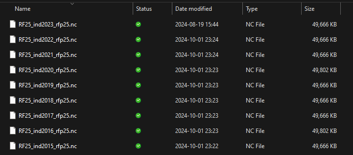

```{r setup, include=FALSE}
knitr::opts_chunk$set(message = FALSE, warning = FALSE, collapse = TRUE)
if (!require(blogdown)) { install.packages('blogdown'); library(blogdown)}
```

## Climatic Data in Hydrological Analysis
Climatic data such as temperature and precipitation are essential for any hydrological analysis. Usually, several years of data are required to do any type of hydrological analysis. The climatic data is obtained from either satellite-based observation or in situ observation.

For hydrological analysis historical precipitation and temperature data is essential. Usually these data can be obtained from Indian Meterolgocal Department (भारतीय मौसम विज्ञान विभाग:IMD) free of cost.

IMD pune provide the gridded precipitation and Temperature data since 1901. Most of time I find many students are struggling to process the data that this either in NetCDF (ext: ".nc"), or Binary data (ext: ".grd"). The processign of both the data is a little different.

## Data source, specifications, and metadata.
To process any data the most important step is metadata. Metadata for temperature and precipitation is shown:


### Rainfall Data:
The rainfall data product is the resolution of daily gridded rainfall data (0.25 x 0.25 degrees). The unit of rainfall is in millimeters (mm). Data available for 122 years, 1901 to 2023. Data is arranged in 135x129 grid points. The first data in the record is at 6.5N & 66.5E, the second is at 6.5N & 66.75E, and so on. The last data record corresponds to 38.5N & 100.0E. The yearly data file consists of 365/366 records corresponding to nonleap/ leap years. You can download it from <https://imdpune.gov.in/cmpg/Griddata/Rainfall_25_NetCDF.html>

### Temperature data (min/max)
IMD High resolution $1\times1$ degree gridded daily temperature data (1951-2018)*. This data is arranged in 31x31 grid points. Lat 7.5N, 8.5N ... 36.5, 37.5 (31 Values). Long 67.5E, 68.5E ... 96.5, 97.5 (31 Values). For leap years, data for 366 days are included. The unit of temperature is in Celsius.
* Gridded data for the years 2008 and onwards are based on a relatively small number of stations (around 180) for which data were received operationally on real time basis.

### Reference paper for more detail
```
Pai et al. (2014). Pai D.S., Latha Sridhar, Rajeevan M., Sreejith O.P., Satbhai N.S. and Mukhopadhyay B., 2014:
Development of a new high spatial resolution (0.25° X 0.25°)Long period (1901-2010) daily gridded rainfall data set over.
India and its comparison with existing data sets over the region; MAUSAM, 65, 1(January 2014), pp1-18.
```

## Processing 'NetCDF'
NetCDF (Network Common Data Form) is a widely used data format designed for storing and sharing scientific data in a structured, self-describing, and platform-independent manner. Developed by Unidata, NetCDF is primarily used in geosciences, such as atmospheric science, hydrology, oceanography, and climate modeling, but can be applied to various other fields requiring efficient storage of multidimensional data.

### Structure of a NetCDF File:
As an example, I am showing the metadata of the IMD precipitation file.

```{json}
File ./RF25_ind2023_rfp25.nc (NC_FORMAT_CLASSIC):

     1 variables (excluding dimension variables):
        double RAINFALL[LONGITUDE,LATITUDE,TIME]
            missing_value: -999
            _FillValue: -999
            long_name: Rainfall
            units: mm
            history: From ind2023_rfp25.grd

     2 dimensions:
        LONGITUDE  Size:135
            units: degrees_east
            point_spacing: even
            axis: X
            modulo: 360
            standard_name: longitude
        LATITUDE  Size:129
            units: degrees_north
            point_spacing: even
            axis: Y
            standard_name: latitude
        TIME  Size:365   *** is unlimited ***
            units: days since 1900-12-31
            axis: T
            calendar: GREGORIAN
            time_origin: 31-DEC-1900
            standard_name: time

    3 global attributes:
        history: FERRET V7.5 (optimized)  6-Feb-24
        Conventions: CF-1.6
```

Based on the aforementioned NetCDF metadata, it consists of three main components:

1. **Dimensions**: These define the shape of the data, such as time, latitude, longitude, or vertical levels. A dimension can be used to describe how many values a variable contains in a specific direction or category.
   - Example: If you have daily temperature data at different locations, the dimensions could be time (number of days), latitude, and longitude.
   - `time`: Unlimited, indicating that more time steps can be added without rewriting the file.
   - `latitude`: 180 values, representing geographic locations from the southern to the northern hemisphere.
   - `longitude`: 360 values, representing locations from west to east around the globe.

2. **Variables**: These store the actual data. Variables can be scalar or multi-dimensional arrays (e.g., temperature, rainfall, or elevation data). Each variable is defined along one or more dimensions and can have associated metadata (attributes).
   - Example: A variable could represent temperature (`temp`), with dimensions `time`, `latitude`, and `longitude`.
   - `rainfall`: A 3D variable that depends on `time`, `latitude`, and `longitude`. It stores daily rainfall values and includes metadata (`units = mm`, `long_name = Daily Rainfall`) to describe the data.
   - `latitude` and `longitude`: 1D variables with values representing geographic coordinates in degrees.
   - `time`: A 1D variable containing time values since a reference date (2000-01-01). The `calendar` attribute specifies the type of calendar system.

3. **Attributes**: These provide additional information about the file or variables, such as units, missing data values, or descriptive text. They are used to describe global properties (applied to the whole dataset) or specific variables.
   - Example: An attribute might define the units of temperature as "degrees Celsius" or mark missing values with a specific value like `-9999`.
   - Metadata about the dataset, such as the title, institution, and data source, which provide context and provenance information.

### Processing NetCDF file
NetCDF file has 3 dimension `lat`, `lon`, and `time (day)`

{fig-align='center'}

Loading `ncdf4` library to process the NetCDF file. Geospatial analysis is performed by `terra` package.
```{r, eval=FALSE}
if (!require(ncdf4)) { install.packages('ncdf4'); library(ncdf4)}
if (!require(terra)) { install.packages('terra'); library(terra)}
if (!require(tidyverse)) { install.packages('tidyverse'); library(tidyverse)}
```

Read shapefile with multiple polygons in it.

```{r, eval=FALSE}
shp <- vect("./Shapefile/Krishna_subbasins.shp")
shp <- project(x = shp, y = "+proj=longlat +datum=WGS84 +no_defs")
plot(shp, bg = "gray")
sbar(d = 1000, type = "bar", divs = 4, below = "km") # Scale
north() # for north arrow.
```

```{r}
rotate_clockwise <- function(x) {t(apply(x, 2, rev))}
rotate_counter_clockwise <- function(x) {apply(t(x),2, rev)}
```
#### Select the year line
```{r, eval=FALSE}
yr <- 2015:2023
rainfall_mat <- timestamp <- c()

for (yr_i in yr) {
    nc_file <- nc_open(paste0("./RF25_ind",yr_i,"_rfp25.nc"))
    # print(nc_file)                      # get info about the file
    names(nc_file$var)                    # Variable i.e. Rainfall
    names(nc_file$dim)                    # Dimenstions (Lat, Lon, time)
    latitude <- nc_file$dim[[1]]$vals
    longitude <- nc_file$dim[[2]]$vals
    time <- nc_file$dim[[3]]$vals
    time_as_date <- as.Date(time, origin = "1900-12-31")
    rainfall <- ncvar_get(nc_file, varid = "RAINFALL")
    r_mat <- matrix(NA, nrow = length(time), ncol = length(shp$OBJECTID))

    for(d_i in seq_along(time)){
        precip_day <- rainfall[, , d_i] %>% rotate_counter_clockwise() %>% rast()
        ext(precip_day) <- c(min(latitude), max(latitude), min(longitude), max(longitude))
        crs(precip_day) <- "+proj=longlat +datum=WGS84 +no_defs"
        r_day <- terra::extract(x = precip_day, y = shp, fun = mean)
        r_mat[d_i, ] <- r_day$lyr.1
        print(paste(d_i, yr_i))
    }
    rainfall_mat <- rbind(rainfall_mat, r_mat)
    timestamp <- append(timestamp, time_as_date)
}
```

#### Process the output
```{r, eval=FALSE}
rainfall_df <-  as.data.frame(rainfall_mat)
rainfall_df <- cbind(timestamp, rainfall_df)
write_csv(rainfall_df, file = "Rainfall.csv")
```

## Processing Binary Data 'GRD' files
The grd file are provided by IMD and reading it a little bit different. The following code demostrate the working with `.grd`.

### Reading files and metadata
```{r, eval=FALSE}
# Working with R blog.

if (!require(terra)) { install.packages('terra'); library(terra)}
f <- "Maxtemp_MaxT_2022.GRD"

# -------------------------------------------------
# Latitude: 7.5:37.5
# Longitude:67.5:97.5
# Resolution : 1 degree
# Temperature units : Celcius
# Missing data : 99.9
# --------------------------------------------------

# https://imdpune.gov.in/cmpg/Griddata/Max_1_Bin.html#
# Get the metadata of the file the previous link

lat <- 31
lon <- 31
nspatial <- lat * lon
```

### Setting up for loop through the daily data
```{r, eval=FALSE}

leap_year <- function(year) {return(ifelse((year %%4 == 0 & year %%100 != 0) | year %%400 == 0, 366, 365)) }
days = leap_year(as.numeric(substr(f, 14, 17)))

# read all the data
m_data <- readBin(f, what = "numeric", size = 4,  n = lat * lon * days)

temp_list <- list()

for(day in 1:days){
    nday = m_data[1+(day*nspatial):(nspatial*(day+1) - 1)]
    m = matrix(nday, lat, lon, byrow=TRUE)
    m[m > 99]=NA
    m = m[nrow(m):1,] # Invert the matrix
    r = rast(m)
    ext(r) = c(67.5, 97.5, 7.5, 37.5)
    crs(r) = "+init=epsg:4326"
    temp_list[[day]] <- r
    rm(r, m)
    print(day)
}

temp_raster <- rast(temp_list)
plot(temp_raster[[122]])
writeRaster(x = temp_raster, filename = paste0("IMD_Temp_", substr(f, 14, 17), ".tif"))

Test <- rast("./IMD_Temp_2022.tif")
```

### Extracting the daily raster stack data with `extract`
We use `terra` r-package to do geoprocessing.

```{r,eval=FALSE}
terra::extract(x, y, fun=NULL, method="simple", fun = FUN)
```
> where:
>
> `x` SpatRaster or SpatVector of polygons
>
> `y` SpatVector (points, lines, or polygons).

You can use any function to aggrigate the value, such as `mean`, `count`, `sum`, or custom.

## Concluding Remarks
Processing climatic data is essential for hydrological analysis. Many R packages and software are available for this. We find `terra` has all the functionality and is fast to process the `.GRD` and '.nc' files. Some important tips:
- Always plot to check the CRS of Raster and Vector data.
- Plot a raster file to check the extent.
- Check the null value carefully from the metadata (-99.9, -9999, etc.)
