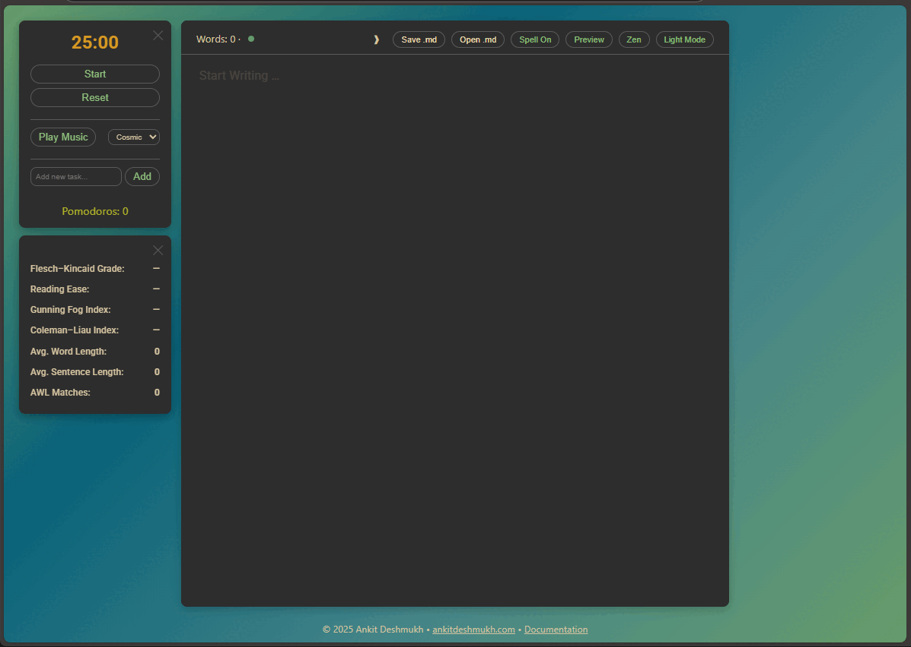

**Application URL:** [https://ankitdeshmukh.com/projects/pomodorowriter/](https://ankitdeshmukh.com/projects/pomodorowriter/)

## Overview

Pomodoro Writer is a web‑based, distraction‑free writing environment that integrates:

- A **Pomodoro timer** with task management and ambient audio
- Real‑time **writing analytics** (readability scores, word count, academic word list)
- **Markdown preview** with **Mermaid diagram** rendering and export
- **File operations** (open/save `.md` files)
- **Zen Mode**, theme switching, and spellcheck toggles



---

## 1. Core Features

### 1.1 Editor

- Powered by **CodeMirror**
  - Dark mode theme: `gruvbox`
  - Light mode theme: `default`
- Full‑screen editing (F11)
- Markdown syntax highlighting

### 1.2 Pomodoro Timer & Tasks

- **Timer** – Default 25:00, controls: Start / Pause / Reset
- **Audio tracks** – Cosmic, Muse, Burble, Focus (unlock on first click)
- **Task list** – Add, toggle complete, delete (persists in `localStorage`)
- **Pomodoro counter** – Increments after each full interval

### 1.3 Writing Analytics

Displayed in top header and collapsible assessment panel:

| Metric               | Description                          |
| -------------------- | ------------------------------------ |
| Word count           | Total words in editor                |
| Flesch–Kincaid Grade | U.S. school grade level required     |
| Reading Ease         | 0–100 (higher = easier)              |
| Gunning Fog Index    | Complexity based on complex words    |
| Coleman–Liau Index   | Grade level from letters & sentences |
| Avg. Word Length     | Characters per word                  |
| Avg. Sentence Length | Words per sentence                   |
| AWL Matches          | Count of Academic Word List terms    |

### 1.4 Markdown Preview

- Toggle **Edit** ↔ **Preview** (Ctrl+L)
- Renders with **marked.js**
- Math expressions via **KaTeX** (delimiters: `$…$`, `$$…$$`, `\(…\)`, `\[…\]`)

### 1.5 Mermaid Diagrams

- Fenced code blocks with language `mermaid` are automatically rendered in Preview mode.
- Each rendered diagram provides two export buttons:
  - **Export SVG** – downloads as `.svg`
  - **Export PNG** – prompts for resolution scale (1–6) and downloads high‑resolution `.png` (via html2canvas)

### 1.6 Theme & UI Toggles

- **Theme** – Dark Mode / Light Mode (affects CodeMirror theme and page background)
- **Spellcheck** – Enable/disable browser spellcheck (Ctrl+K)
- **Zen Mode** – Hides header, footer, timer, and assessment panel (Ctrl+Z)

### 1.7 File Operations

| Action     | Shortcut | Description                                                                    |
| ---------- | -------- | ------------------------------------------------------------------------------ |
| Save `.md` | Ctrl+S   | Uses File System Access API (Chromium browsers). Saves current editor content. |
| Open `.md` | Ctrl+O   | Loads a Markdown file from local disk, replaces editor content.                |

---

## 2. Usage Guide

### 2.1 First Access

1. Open the application in a modern browser (Chrome, Edge, or Chromium‑based).
2. Click or tap anywhere to unlock audio playback.

### 2.2 Writing & Markdown

- Write directly in the editor. Use standard Markdown syntax.
- For a Mermaid diagram, insert:
  ```mermaid
  graph TD
    A[Start] --> B{Decision}
    B -->|Yes| C[Option 1]
  ```

### 2.3 Timer & Tasks

1. Click **Start** – the countdown begins and selected background audio plays.
2. At zero, an alert appears and the Pomodoro counter increments.
3. **Add tasks** – type description → Enter or click **Add**.
4. **Manage tasks** – use ✔ (complete), ↺ (reopen), ✕ (delete).

### 2.4 Preview & Diagram Export

1. Click **Preview** (or Ctrl+L) to render Markdown, math, and Mermaid diagrams.
2. Below each diagram, click **Export SVG** or **Export PNG**.

- For PNG, enter a scale (e.g., `3` for 3× resolution).

3. Click **Edit** (or Ctrl+L) to return to the editor.

### 2.5 Saving / Opening Files

- **Save** – Ctrl+S → choose location and filename (default `document.md`).
- **Open** – Ctrl+O → select a `.md` file → content loads into editor.

### 2.6 UI Adjustments

- **Theme** – Click **Light Mode** / **Dark Mode** button.
- **Spellcheck** – Click **Spell On/Off** or Ctrl+K.
- **Zen Mode** – Ctrl+Z to enter/exit. Press Esc or Ctrl+Z to exit.
- **Minimize panels** – Click the ✕ on the Pomodoro timer or Assessment panel, or press Ctrl+M.

---

## 3. Keyboard Shortcuts Reference

| Shortcut (Windows/Linux) | macOS | Action                                          |
| ------------------------ | ----- | ----------------------------------------------- |
| F11                      | F11   | Full‑screen editor (CodeMirror)                 |
| Esc                      | Esc   | Exit full‑screen or Zen Mode                    |
| Ctrl+L                   | ⌘ + L | Toggle Editor / Preview                         |
| Ctrl+K                   | ⌘ + K | Toggle spellcheck                               |
| Ctrl+M                   | ⌘ + M | Minimize / restore Pomodoro & Assessment panels |
| Ctrl+S                   | ⌘ + S | Save Markdown file                              |
| Ctrl+O                   | ⌘ + O | Open Markdown file                              |
| Ctrl+Z                   | ⌘ + Z | Enter / exit Zen Mode                           |

---

## 4. Technical Notes

- **File System Access API** – Required for Save/Open operations. Fully supported in Chromium‑based browsers.
- **Audio unlock** – Browsers require a user interaction before audio can play. The app unlocks audio on the first click/touch anywhere.
- **Persistence** – Task list is stored in `localStorage` (no backend).
- **Mermaid export** – PNG export uses `html2canvas`; scale values above 6 may cause performance issues.
- **Spellcheck** – Relies on the browser’s native spellchecking; languages vary by browser settings.

---
