class: center middle inverse

<!-- knitr and citation setting -->
```{r setup, include=FALSE}
options(htmltools.dir.version = FALSE)
knitr::opts_chunk$set(
  #out.width = "100%",
  cache = FALSE,
  echo = TRUE,
  message = FALSE, 
  warning = FALSE,
  fig.show = TRUE,
  hiline = TRUE,
  results = "asis" 
)

# Bibliography and Citation  
if(!require(RefManageR)){install.packages("RefManageR");library(RefManageR)}

if(!require(bibtex)){install.packages("bibtex");library(bibtex)}

BibOptions(check.entries = FALSE, bib.style = "authoryear", style = "text", first.inits = FALSE)
bib <- ReadBib("~/adx/Bibliography.bib")
```

<!-- Xaringan Extra Setting  -->
```{r, echo=FALSE, include=TRUE}
library(xaringanExtra)
#use_panelset()
use_logo(image_url = "./css/Blog-Logo.png", link_url = "https://www.ankitdeshmukh.com/", width = "60px", height = "60px")
use_progress_bar(color = "#282828",location = "top", height = "0.25em")
use_tile_view()
use_extra_styles(hover_code_line = TRUE, mute_unhighlighted_code = FALSE)
```

.f2.gold[❝80 percent of the final exam will be based on the one lecture you missed and the one book you didn't read.❞]<br /> 
~ Unknown ~

---
# Atmospheric window
- The Earth's atmosphere selectively transmits the energy of specific wavelengths. 
- The wavelength easily transmitted through the atmosphere can be called atmospheric windows.
- Only radiation in these wavelengths can be transmitted through the atmosphere.
- Atmospheric windows are mainly due to absorption within the atmosphere. 

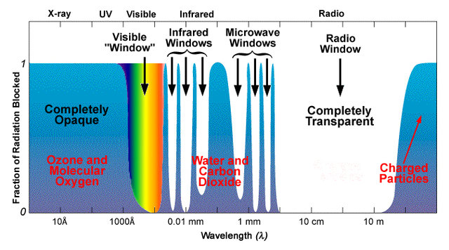

Atmospheric windows are significant for remote sensing because energy within the windows conveys information about the radiometric properties of the objects and thus helps produce satellite images.

.footnote[Image Source: https://earthobservatory.nasa.gov]

---
# Remote sensing data acquisition is limited through these atmospheric windows]

1. .b.blue[Wavelengths shorter than 0.1 μm:] Absorbed by Nitrogen and other gaseous components.
2. .b.blue[Wavelengths shorter than 0.3μm (X- rays, Gamma rays, and part of ultraviolet rays):] Mostly absorbed by the ozone (O<sub>3</sub>).
3. .b.blue[Visible part of the spectrum:] Little absorption occurs.
4. .b.blue[Oxygen in the atmosphere causes absorption centered at 6.3μm]
5. .b.blue[Infrared (IR) radiation:] Mainly absorbed by water vapor and carbon dioxide molecules.
6. .b.blue[Far infrared region]: Mostly absorbed by the atmosphere.
7. .b.blue[Microwave region:] Absorption is almost nil.

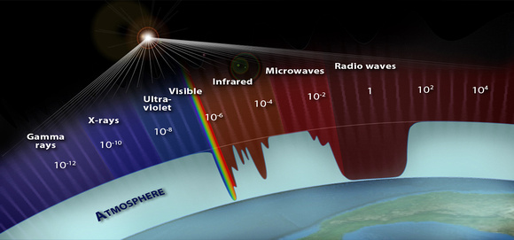

.footnote[Image Source: <br />  https://www.zina-studio.com/]

---
# Platforms and sensors
- A platform is the vehicle or carrier for remote sensors for which they are borne.

- Platforms mount sensors that obtain data for remote sensing purposes.

- Platforms are classified according to their heights and events to be monitored.

--

- Platforms used for remote sensing:
  - Ground-based
  - Airborne 
  - Spaceborne


---
# Remote Sensing Sensors
- Sensor is an electronic circuit that can record the electromagnetic radiation incident upon it
- It senses a variation in input energy to produce a variation in another form of energy.
- Sensor comprises of several components such as: 
  - System to receive radiation from the pixel and a telescope (objective),
  - Calibration source and spectrometer,
  - Amplifier and recording system.
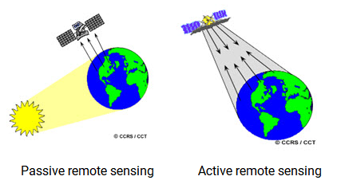

.footnote[Source: http://ecoursesonline.iasri.res.in/mod/page/view.php?id=124941]

---
# Classification of Remote Sensing Sensors
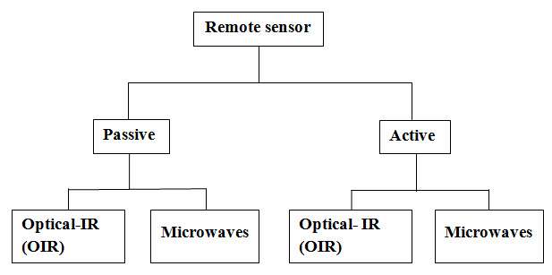
.gray.center[Remote sensing sensors classification.  `r Citep(bib, "joseph2020fundamentals")`]

The sensors are classified based on their working principles and recording methodology:
1. Photographic camera
1. The vidicon using detecting media as a television camera
1. The optical scanner
1. Microwave radiometer
1. Microwave radar

---
# Ground Resolution versus Repeatability
.pull-left[
- The choice of a remote sensing system with its achievable resolution and repeatability to obtain data.

- Geostationary meteorological satellites such as Meteosat permit the imaging of the entire hemisphere with 5 km pixels. This can be achieved every 30 minutes.

]

.pull-right[
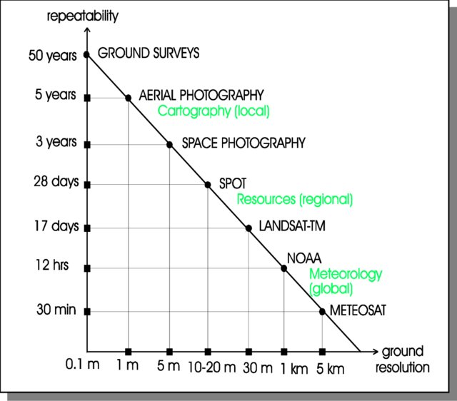

.footnote[credit: [Gottfried Konecny](https://www.researchgate.net/profile/Gottfried-Konecny) ]
]

---
# Sensors Parameters and Resolution
#### In remote sensing, resolution means the resolving power: 

- Capability to identify the presence of two objects
- Capability to identify the properties of the two objects

--

#### 4 types of resolutions are defined for the remote sensing systems
1. Spatial resolution (what area and how detailed)
1. Spectral resolution (what colors – bands)
1. Temporal resolution (time of day/season/year)
1. Radiometric resolution (sensitivity of a remote sensor)

--
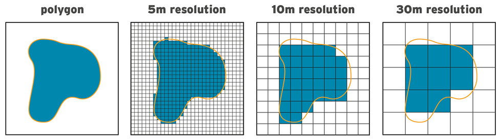

.footnote[Source: https://www.jbarisk.com/]

---
# Landsat program
.pull-left[
- The Landsat program is the longest-running enterprise for the acquisition of satellite imagery of Earth. 

- On 23 July 1972, the Earth Resources Technology Satellite (was renamed to Landsat-1 in 1975). 

- The most recent, Landsat 9, was launched on 27 September 2021.

- Read more https://en.wikipedia.org/wiki/Landsat_program
]

.pull-right[


.blue.center[A land cover map of the big island of Hawaii uses 1999-2001 data from Landsat 7, showing black lava flows from Mauna Loa, grayish dormant Mauna Kea, a plume of smoke from active Kilauea, dark green tropical forests, and light green agricultural areas.]

]

---
# False Color Images
Images have colors recorded in the visible or non-visible parts of the electromagnetic spectrum. 

--

**Our four most common false-color band combinations are:**

- Near-infrared (red), green (blue), red (green). *This is a traditional band combination helpful in seeing changes in plant health.*

--

- Shortwave infrared (red), near-infrared (green), and green (blue). *Often used to show floods or newly burned land.*

--

- Blue (red), two different shortwave infrared bands (green and blue). *We use this to differentiate between snow, ice, and clouds.*

--

- Thermal infrared. *Usually shown in tones of gray to illustrate temperature.*

.footnote[For more details, read: https://earthobservatory.nasa.gov/features/FalseColor/page6.php]

---
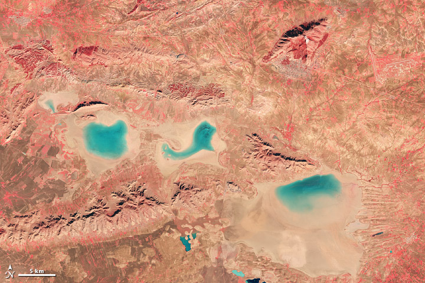

Near-infrared, red, and green light were used to create this false-color image of Algeria. Red, plant-covered land dominates the scene. *(NASA image by Robert Simmon with Landsat 8 data from the USGS Earth Explorer.)*

---
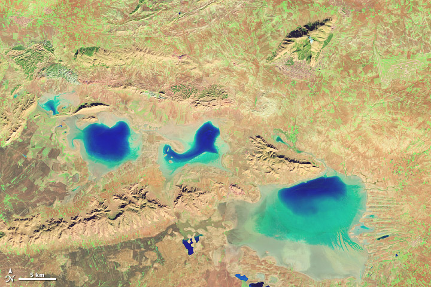
The shortwave, near-infrared, and green light version of the Algeria scene highlights the presence of water and wet soil in an otherwise dry landscape. *(NASA image by Robert Simmon with Landsat 8 data from the USGS Earth Explorer.)*

---
# Landsat sensors 
- .red.b[Landsat 1 through 5 carried the Landsat Multispectral Scanner (MSS).]

- Landsat 4 and 5 carried both the MSS and Thematic Mapper (TM) instruments.

- Landsat 7 uses the Enhanced Thematic Mapper Plus (ETM+) scanner. 

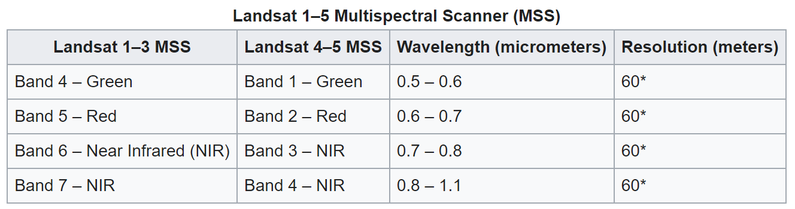

---
# Landsat sensors 
- Landsat 1 through 5 carried the Landsat Multispectral Scanner (MSS).

- .red.b[Landsat 4 and 5 carried both the MSS and Thematic Mapper (TM) instruments.]

- Landsat 7 uses the Enhanced Thematic Mapper Plus (ETM+) scanner. 

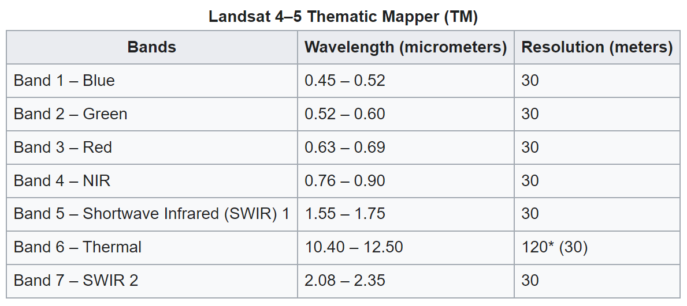

---
# Landsat sensors 
- Landsat 1 through 5 carried the Landsat Multispectral Scanner (MSS).
- Landsat 4 and 5 carried both the MSS and Thematic Mapper (TM) instruments.
- .red.b[Landsat 7 uses the Enhanced Thematic Mapper Plus (ETM+) scanner.]

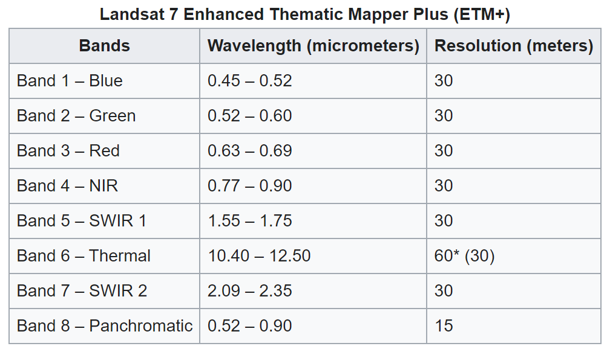

---
# Landsat-9
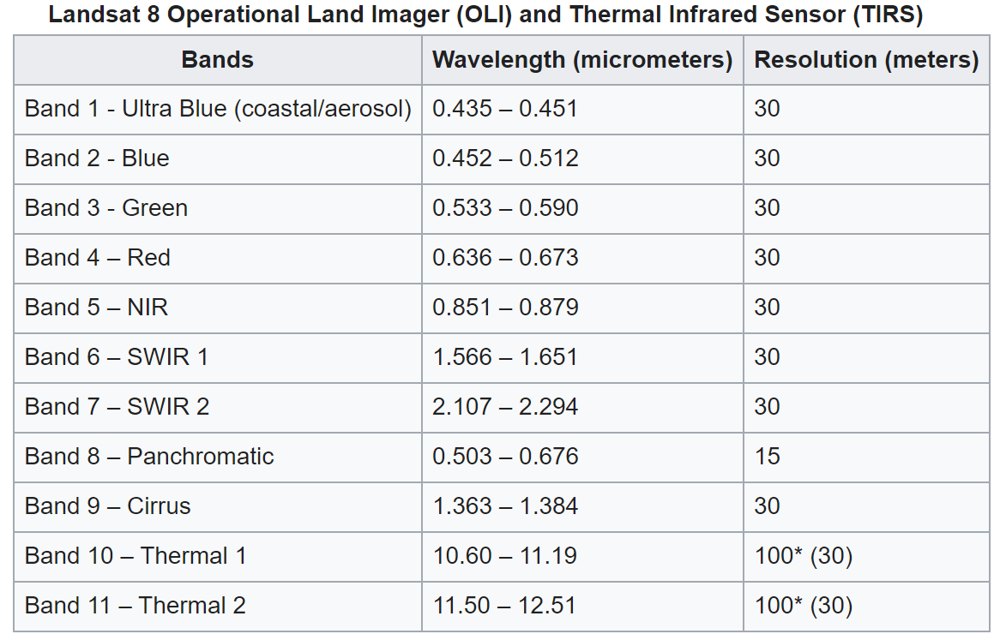
.footnote[Source: https://en.wikipedia.org/wiki/Landsat_program]

---
# Comparision of Landsat sensors
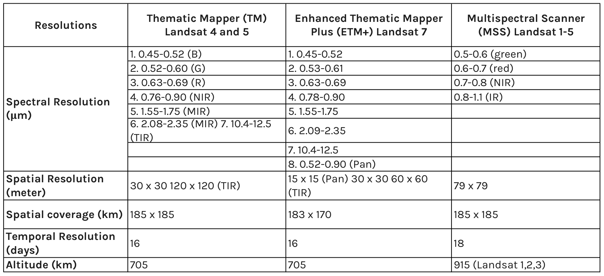

---
# Spatial Resolution
Size of the smallest dimension on the Earth's surface over which an independent measurement can be made by the sensor.

- Expressed by the size of the pixel on the ground in meters

- Controlled by the Instantaneous Field of View (IFOV)

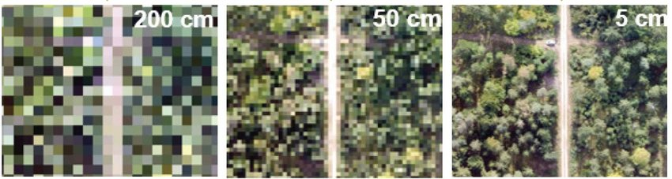

<div class="flex"> <div class="w-30 pa2 mr1 center">
.f2.orange[200cm]
</div> <div class="w-40 pa2 mr1">
.center.f2.orange[50cm]
</div> <div class="w-30 pa2 mr1">
.center.f2.orange[5cm] </div> </div>

---
# Spatial Resolution and Feature Identification
.pull-left[
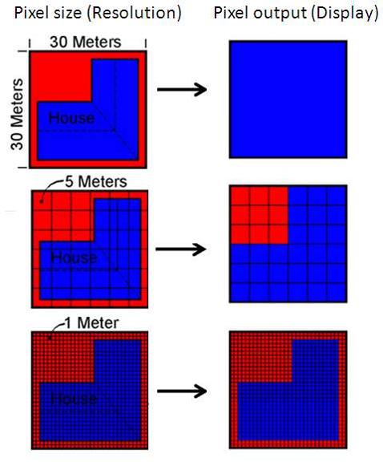
]

.pull-right[
.center.b[Example]
<br /> <br /> 
Signature from the "house" dominates
for the cell and hence the entire cell is
classified as "house".

<br /> <br /> 
The shape and spatial extent of the feature is better
captured. However, some discrepancy is
present along the boundary.

<br /> <br /> 
Feature shape and the spatial extent is
more precisely identified

]

.footnote[Image source: https://www.satimagingcorp.com/]

---
# Classes of Spatial Resolution

1. Low-resolution systems
  - Spatial resolution > 1km
  - MODIS, AVHRR

--
  
1. Medium resolution systems
  - Spatial resolution is 100m – 1km
  - IRS WiFS (188m), Landsat TM–Band 6 (120m), MODIS–Bands 1-7 (250-500m)

--

1. High-resolution systems
  - Spatial resolution is approximately in the range of 5-100m
  - Landsat ETM+ (30m), IRS LISS-III (23m MSS, 6m Panchromatic), IRS AWiFS (56-
70m), SPOT 5(2.5-5m Panchromatic)

--

1. Very high-resolution systems
  - Spatial resolution less than 5m
  - GeoEye (0.45m for Panchromatic, 1.65m for MSS), IKONOS (0.8-1m Panchromatic),
  - Quickbird (2.4-2.8 m)


---
# Spectral resolution of a sensor

.pull-left[
The spectral resolution is: 
- Ability of a sensor to define fine wavelength intervals
- Ability of a sensor to resolve the energy received in spectral bandwidth.

Spectral resolution depends on
- Spectral bandwidth of the filter
- Sensitiveness of the detector

The finer the spectral resolution, the narrower the wavelength range for a particular channel or band.

]

.pull-right[
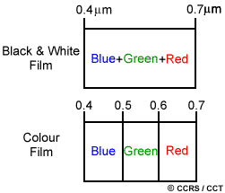
]

---
# RGB Band Composite
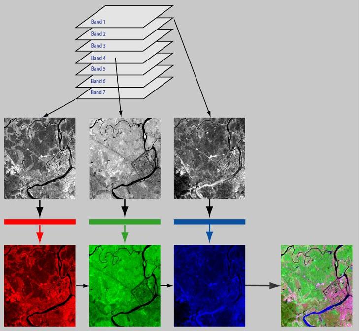

.footnote[Source: Wilfredo M. Rada]

---
## Finer the spectral resolution, the narrower the wavelength range for a particular channel or band.
.pull-left[
Most remote sensing systems are multi-spectral, using more than one spectral band.

- Spectral resolution of some of the remote sensing systems IRS LISS-III uses four bands: (green), (red), (near IR), and 1.55-1.70.

- The Aqua/Terra MODIS instruments use 36 spectral bands, including three in the visible spectrum.

- Recent development is the hyper-spectral sensors, which detect hundreds of very narrow spectral bands.
]

.pull-right[
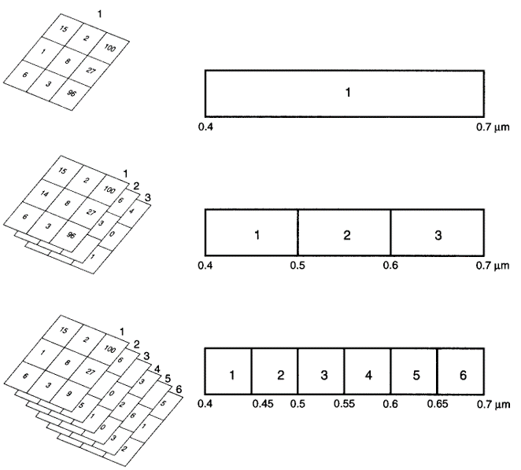
]

---
# Spectral Resolution Bands
.pull-left[
- Number of spectral bands (red, green, blue, NIR, Mid-IR, thermal, etc.)
- Width of each band
- Certain spectral bands (or combinations) are good for identifying specific ground features

- Panchromatic – 1 band (B&W)
- Color – 3 bands (RGB)
- Multispectral – 4+ bands (e.g. RGBNIR)
- Hyperspectral – hundreds of bands

]

.pull-right[
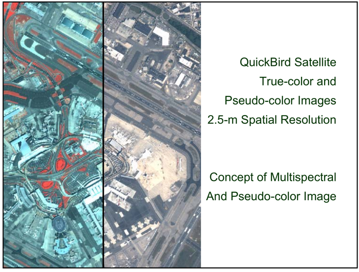
]

---
## Different features are identified from the image by comparing their responses over different distinct spectral bands
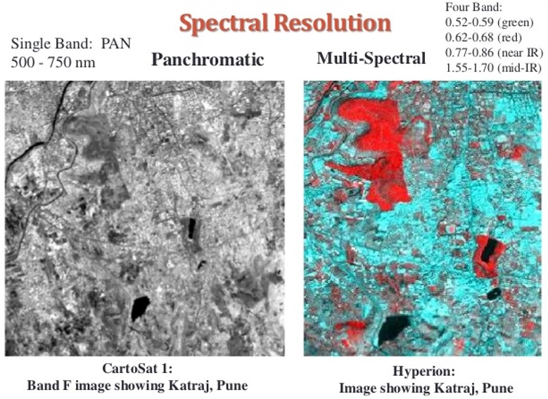

---
# Images in different bands
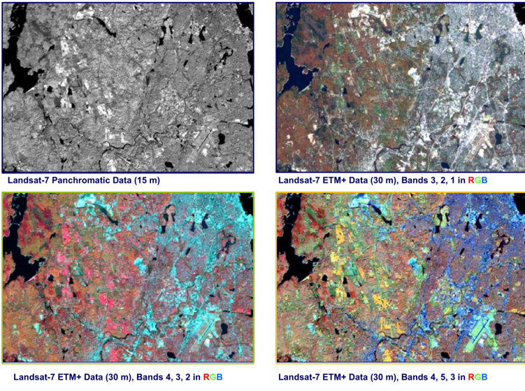

---
# Temporal (time of day/season/year) resolution 	
.left-column[
**Time of day/season image acquisition**
- Leaf on/leaf off
- Tidal stage
- Seasonal differences
- Shadows
- Phenological differences
- Relationship to field sampling
- Seasonal Considerations

]

.right-column[

]

---
## Animation shows deforestation and river course change in Assam in the last three decades.
.footnote[Source: Raj Bhagat Palanichamy]

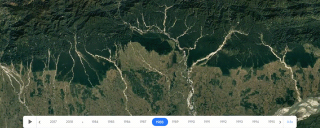

---
# River path change with time
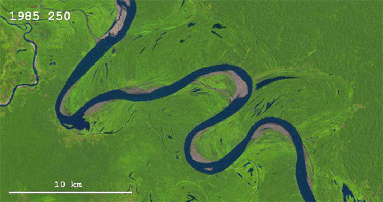

.footnote[Image source: https://sploid.gizmodo.com/]

---
# Radiometric Resolution 
While the arrangement of pixels describes the spatial structure of an image, the radiometric characteristics describe the actual information content in an image.

- Every time an image is acquired by a sensor, its sensitivity to the magnitude of the electromagnetic energy determines the
**radiometric resolution**. 

- The more refined the radiometric resolution of a sensor, the more sensitive it is to detecting minor differences in reflected or emitted energy.

---
# Radiometric Resolution 
- Imagery data are represented by positive digital numbers, which vary from 0 to a selected power of 2.

- Each bit records an exponent of power 2.

- The maximum number of brightness levels available depends on the number of bits used in representing the energy recorded.

- Thus, if a sensor used 8 bits to record the data, there would be 2<sub>8</sub> = 256 digital values available, ranging from 0 to 255.


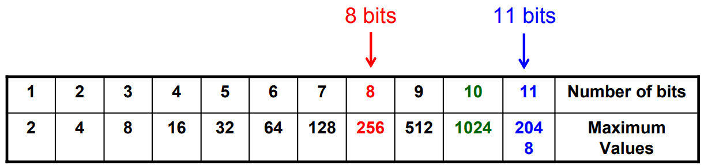

.footnote[Data volume will increase as the radiometric resolution increases?]

---
# Gray Scale Image
.pull-left[

- Most raw unprocessed satellite imagery is stored in a grayscale format.

- A gray scale is a color scale that ranges from black to white, with varying intermediate shades of gray.

- A commonly used grayscale for remote sensing image processing is a 256-shade grayscale.
]
.pull-right[
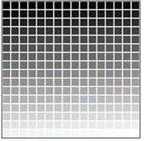
.center[256 level gray scale]
]

---
# Gray Scale image
Each pixel has an **intensity value** (represented by a digital number)

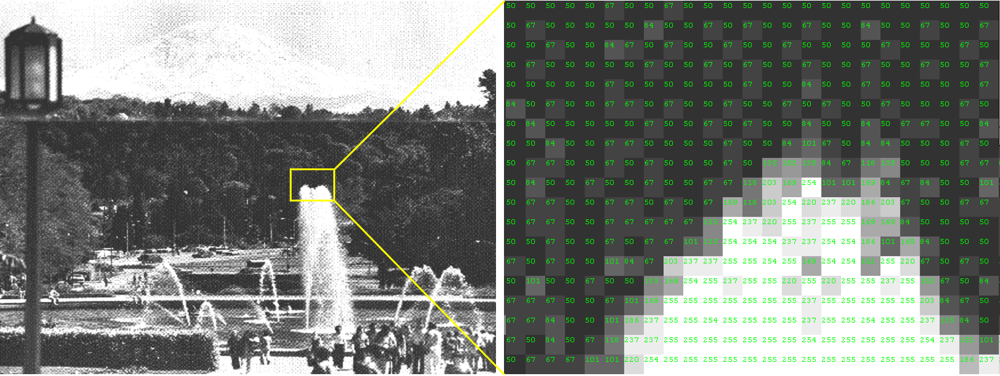


---
# A sample grayscale image


.footnote[https://learnlearn.uk/binary/wp-content/uploads/sites/11/2017/01/tree-pciture-grayscale.jpg]

---
# Sample images 
<div class="flex"> <div class="w-50 pa2 mr1">


</div> <div class="w-50 pa2 mr1">

</div> </div>

---

## Output Images with indivisual bands 
```{r echo=FALSE, fig.width=10}
if(!require(raster)){install.packages("raster");library(raster)}

ing_in <- "./images/Sample1.jpg"

Red <- raster(x = ing_in, band = 1)
Green <- raster(x = ing_in, band = 2)
Blue <- raster(x = ing_in, band = 3)

par(mfrow = c(1,3))
num_col = 10
image(Red, col = cm.colors(num_col), main = "Red Color Band")
image(Green, col = cm.colors(num_col), main = "Green Color Band")
image(Blue, col = cm.colors(num_col), main = "Blue Color Band")

```

---
# Extract the pixel values

```{r, eval=FALSE}
if(!require(raster)){install.packages("raster");library(raster)}

ing_in <- "Sample1.jpg"

Red <- raster(x = ing_in, band = 1)
Green <- raster(x = ing_in, band = 2)
Blue <- raster(x = ing_in, band = 3)

par(mfrow = c(1,3))
num_col = 256
image(Red, col = cm.colors (num_col), main = "Red Color Band")
image(Green, col = cm.colors(num_col), main ="Green Color Band")
image(Blue, col = cm.colors(num_col), main ="Blue Color Band")

write.csv(x = as.matrix(Green), 
          file = "Green.csv", 
          row.names = FALSE)
```

