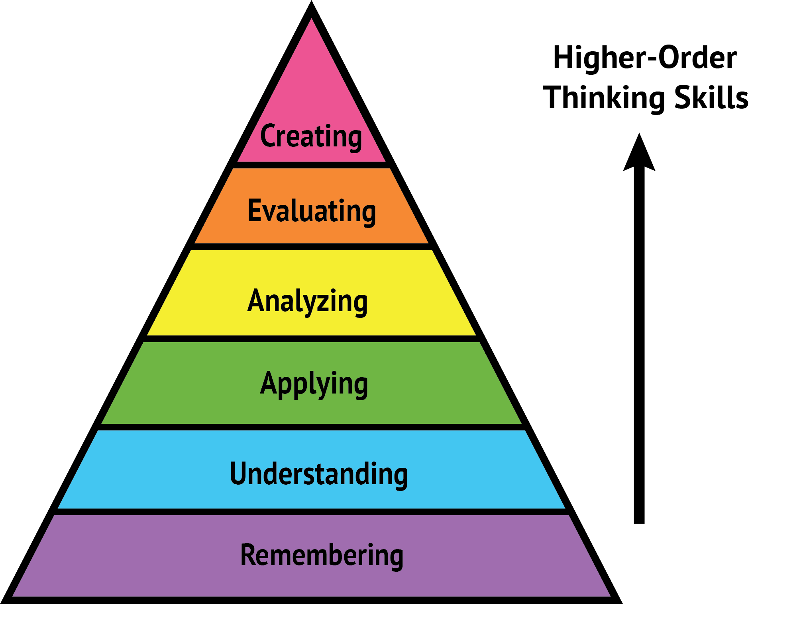

class: center middle inverse

```{r setup, include=FALSE}
options(htmltools.dir.version = FALSE)
knitr::opts_chunk$set(
  #out.width = "100%",
  cache = FALSE,
  echo = TRUE,
  message = FALSE, 
  warning = FALSE,
  fig.show = TRUE,
  hiline = TRUE,
  results = "asis" 
)

# Bibliography and Citation  
library(RefManageR)
library(bibtex)
BibOptions(check.entries = FALSE, bib.style = "authoryear", style = "text", first.inits = FALSE)
bib <- ReadBib("~/adx/Bibliography.bib")
```

```{r, echo=FALSE, include=TRUE}
library(xaringanExtra)
use_logo(image_url = "./css/Blog-Logo.png", link_url = "https://www.ankitdeshmukh.com/", width = "60px", height = "60px")
use_progress_bar(color = "#282828",location = "top", height = "0.25em")
use_tile_view()
use_extra_styles(hover_code_line = TRUE, mute_unhighlighted_code = FALSE)
```

# .white[“How did it get so late so soon?” <br /> .f3[~ Dr. Seuss ~]]

`r fontawesome::fa("atom", fill = "white", height = "3em")`

---
# Welcome to Geospatial Techniques (20CV214T)
.f3.purple[Hi, I am .b[Dr. Ankit Deshmukh!]]

--

- Specialized in Hydrology and water resource engineering.

- My PhD in “Vulnerability estimation of catchment to climate change” from IIT Hyderabad.

- Interests: Data analysis, hydrology, climate change, creative, coding, and music.

- Languages: R, Python, MatLab. (also English & Hindi)

--
<br /> <br /> 
<div class="boxed" style="--width-var: 600px;">
.b.center[Contact]
.b[Email:] <a href="mailto:ankit.deshmukh@sot.pdpu.ac.in">ankit.deshmukh@sot.pdpu.ac.in</a><br /> 
.b[Office:] D-Block Cubical C-8 (in Office hours)
</div>

.footnote[
[`r fontawesome::fa("globe", fill = "#27348A")` ankitdeshmukh.com](www.ankitdeshmukh.com) | 
[`r fontawesome::fa("twitter", fill = "#3687F1")` anix7n](https://twitter.com/anix7n) | 
[`r fontawesome::fa("linkedin", fill = "#6476C0")` anixn](https://www.linkedin.com/in/anixn/)
]

---
# Timetable

```{r, include=TRUE, echo=FALSE, fig.align='center'}
knitr::include_graphics("images/Timetable.png", error = FALSE)
```

**Office Hours:** Thursday and Friday at 12:00 to 13:00.
---
# Academic calendar 2022-23 (Even semester)
```{r, include=TRUE, echo=FALSE, fig.align='center', out.width="55%"}
knitr::include_graphics("images/Acad Calendar.png", error = FALSE)
```

---

# Outcome Based Education 

.pull-left[
### COURSE OUTCOMES
On completion of the course, student will be able to

**CO1** – .b.red[Understand] the basic concept of Remote Sensing and GIS techniques.

**CO2** – .b.red[Classify] the advance instrument techniques (GPS and UAV) in surveying.

**CO3** – .b.red[Analyse] a data using a spatial analysis techniques

**CO4** – .b.red[Illustrate] the application of RS and GIS in decision making activities

**CO5** – .b.red[Appraise] the use of advance software techniques for map making activities.

**CO6** – .b.red[Create] an art of map making activities.
]

.pull-right[

.footnote[https://blog.testdome.com/]
]

---

# Teaching Scheme & Objectives

```{r, include=TRUE, echo=FALSE, fig.align='center'}
knitr::include_graphics("images/Scheme.jpg", error = FALSE)
```

**Course Objective:**
- To understand the fundamental of RS and Image processing.

- To understand the fundamentals of GIS and Processes.

- To understand the utilization of GPS and UAV for engineering mapping

- To learn the complex engineering application using Geospatial Techniques

---
# Syllabus .f2.light-red[| 52 Hour]

#### UNIT-1: REMOTE SENSING (10 Hours)
Basic principles of remote sensing- Electromagnetic energy and spectrum- Spectral characteristics,-Laws of radiation-Interaction with atmosphere and surface- Data and image interpretation- Sensors and platforms- Visible and infrared sensors- IR and MW sensors- Resolutions- visual image analysis and processing- Supervised and unsupervised classifications- LIDAR remote sensing- Passive and active microwave remote sensing- Hyper spectral remote sensing- Improving the utilization of remote sensing data- Emerging issues UAV and Drone techniques

#### UNIT-2: GEOGRAPHICAL INFORMATION SYSTEM (12 Hours)
Introduction - History of GIS- Basic GIS concepts- Representation of earth features- Map basics- Map projections- Raster and vector data models- representation of GIS- GIS data sources- Map and models- Methods of vector and raster inputs- Remote sensing inputs- Surveys and GPS inputs- Field surveys- Data storage and editing- Errors and corrections of errors.

#### UNIT-3: SPATIAL ANALYSIS TOOLS AND TECHNIQUES (10 Hours)
Spatial analysis- Location and identifying spatial objects- Measurements- Surface mapping- Nontopographical surfaces- Terrain analysis- Spatial arrangements- Map overlays- Cartographic modelling- Types of cartographic models- GIS design and applications- Decision support tools for engineers Spatial and Attribute Data Modelling

---
# Syllabus .f2.light-red[| 52 Hour]

#### UNIT 4 CASE STUDY AND APPLICATION (10 Hours)
Software tools- ERDAS- ENVI- Q-GIS and ARC GIS- Application and case studies of a RS and GIS techniques in Infrastructure management- Environmental Engineering- Transportation Engineering-Disaster management. Indian Satellite Missions-Chnadrayaan- 1and 2- NISAR- Vedas- Mars orbiter Mission-ASTROSAT-Gaganyaan-RISAT-1A-Aditya-L1-Shukrayaan-1

---
# Text/Reference books

1. Thomas M. Lillesand, Ralph W. Kiefer, Remote sensing and image interpretation
2. Haywood L, Cornelius S and S Carver (1988) An Introduction to Geographical Information Systems, Addison Wiley Longmont, New York.
3. Burrough PA, McDonnell PA (2000) Principles of Geographical Information systems, London: Oxford University Press.
4. LoCP, Young KW Albert (2002) Concepts And Techniques of Geographic Information Systems, Prentice-Hall of India Pvt ltd, New Delhi

---
class: center inverse middle
.co-warn[.gold.f1[REMOTE SENSING]]

---
# Is Greenland larger than Australia?

```{r, include=TRUE, echo=FALSE, out.width='65%', fig.align = 'center'}
knitr::include_graphics("Images/Worldmap.jpg", error = FALSE)
```

.footnote[Image source: http://getwallpapers.com/]

---
# Is Greenland larger than Australia?

.pull-left[
```{r, include=TRUE, echo=FALSE, out.width='100%', fig.align = 'center'}
knitr::include_graphics("Images/G-A.png", error = FALSE)
```
]

--
.pull-right[
.f2[Considering the land area, Australia (7,741,220 km<sup>2</sup>) is **almost four times** bigger than Greenland (2,166,086 <sup>2</sup>).]
]

.footnote[Source: https://www.wikipedia.org/]
---

# Importance of maps 

```{r, echo=FALSE, fig.height=7, fig.width=15.5, fig.align='center'}
if(!require(leaflet)){install.packages("leaflet");library(leaflet)}

m <- leaflet() %>%
  addTiles() %>%  
  setView(lng = 72.666, lat = 23.154, zoom = 15) %>%
  addMarkers(lng=72.66689, lat=23.15462, popup="Welcome to PDEU!")
m
```
---

# Map helps us to identify the relative position of different features.

```{r, include=TRUE, echo=FALSE, fig.cap="Frederik De Wit’s 1654 Dutch Sea Atlas. Image courtesy of the Harvard Map Collection", out.width=550, fig.align='center'}
knitr::include_graphics("images/OldMap.jpg", error = FALSE)
```

--

.light-red[.f4[To identify features we need a suitable *co-ordinate reference system (CRS)*]]

---

# Shape of the earth is not a perfect sphere!
```{r, include=TRUE, echo=FALSE, out.width="55%", fig.align='center'}
knitr::include_graphics("images/Geoid.gif", error = FALSE)
```
--
It's a .b[.red[Geoid]], this is defined as the equipotential surface that most closely corresponds to mean sea level (pear-shaped).

---

# An approximate shape of the earth

```{r, include=TRUE, echo=FALSE, out.width=700, fig.align='center'}
knitr::include_graphics("images/Elliposide.gif", error = FALSE)
```

- A Reference Ellipsoid is a mathematically defined surface that approximates the Geoid. 
- The most popular reference ellipsoid is **WGS 1984**.

.footnote[Source: https://kartoweb.itc.nl/]

---

# Projections are used to transform 3D spherical surface to 2D on a plane

```{r, include=TRUE, echo=FALSE, fig.align='center', out.width=800}
knitr::include_graphics("images/ProjectionSys.png", error = FALSE)
```

--

It is impossible to represent a 3D object on a single 2D map without losing information.

---

# Which map is correct?

```{r, include=TRUE, echo=FALSE, out.width=860, fig.align='center'}
knitr::include_graphics("images/USmap.jpg", error = FALSE)
```

.footnote[Source: https://knowwhereconsulting.co.uk/  ]

---
# Introduction - RS, GIS, and GPS

.pull-left[

<br /> <br /> 
```{r, echo=FALSE, fig.align='center'}
DiagrammeR::mermaid("
graph LR
  A(Remote Sensing) --> D(Geospatial <br /> Techniques)
  B(Geographical <br /> information systems) --> D
  C(Global<br /> Positioning System) --> D
  D --> E(Applications)
  style A fill:#AFE9AD;
  style D fill:#FFD740;
  ",
  width = "100%",
  height = "10%"
)
```
]

.pull-right[

**Remote sensing: ** The process of detecting and monitoring the physical characteristics of an area by measuring its reflected and emitted radiation at a distance [Source: USGS](https://www.usgs.gov/).

--

**A Geographic Information System (GIS):** A computer system that analyzes and displays geographically referenced information. It uses data that is attached to a unique location [Source: USGS](https://www.usgs.gov/).

--

**The Global Positioning System (GPS):** A space-based radionavigation system, owned by the U.S. Government and operated by the United States Air Force (USAF) [Source: www.nasa.gov](https://www.nasa.gov/directorates/heo/scan/communications/policy/what_is_gps).

]

---

# Applications of Geospatial Analysis/GIS

.pull-left[
1. Agriculture
  - Drought
  - Pest control
  - Land and Soil analysis
  - Planning of future food demand
  
2. Urban and Town Planning.
3. Oil Spill
4. Disaster Management
5. Mapping and Navigation
  - Google Maps
  - Open street maps [OSM]
6.  Deforestation and Vegetation Management
]

.pull-right[
```{r, include=TRUE, echo=FALSE, fig.align='center', out.width="70%"}
knitr::include_graphics("images/GS-App.png", error = FALSE)
```
]

.footnote[Image Source: i0.wp.com & esri.com]

---
# Deforestation assessment
```{r, include=TRUE, echo=FALSE, fig.align='center', out.width="80%"}
knitr::include_graphics("images/Deforestation.gif", error = FALSE)
```

Satellite imagery from Google Earth Engine’s Timelapse platform shows deforestation progressing on the Brazilian side of Brazil/Bolivia border from 1984 to 2016.

---
# Land cover change - Urbanization

```{r, include=TRUE, echo=FALSE, fig.align='center', out.width="65%"}
knitr::include_graphics("images/Urbanization.gif", error = FALSE)
```

In the last two decades, India has urbanized at an unprecedented rate. This image shows the growth of Bangalore between 1990 and 2015.


---
class: inverse middle center

# .gold[Thank you!<br />Questions?]
