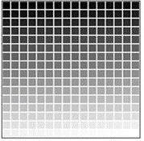

class: center middle inverse

```{r setup, include=FALSE}
options(htmltools.dir.version = FALSE)
knitr::opts_chunk$set(
  out.width = "100%",
  cache = FALSE,
  echo = TRUE,
  message = FALSE,
  warning = FALSE,
  fig.show = TRUE,
  hiline = TRUE,
  results = "asis"
)

# Bibliography and Citation
library(RefManageR)
library(bibtex)
BibOptions(check.entries = FALSE, bib.style = "authoryear", style = "text", first.inits = FALSE)
bib <- ReadBib("~/adx/Bibliography.bib")
```

```{r, echo=FALSE, include=TRUE}
library(xaringanExtra)
use_logo(image_url = "./css/Anix-Logo.png", link_url = "https://www.ankitdeshmukh.com/", width = "60px", height = "60px")
use_progress_bar(color = "#28282888",location = "top", height = "0.25em")
use_extra_styles(hover_code_line = TRUE, mute_unhighlighted_code = FALSE)
use_xaringan_extra(c("tile_view", "tachyons", "use_logo", "use_progress_bar"))
```

<!-- ------------------------- Start your slides ------------------------- -->

# .white[Sooner or later all things are numbers, yes?] 
.b.center[~ Terry Pratchett ~]

---
# Topics to be covered for .blue["Digital Image processing"]

- Characteristics of a digital image

- Image enhancement

- Contrast manipulation

- Image registration 

- Digital image interpretation techniques.

---
# Types of data products in remote sensing 

- Depending on  correction applied  & level of processing


---
# Image interpretation strategy and elements of image interpretation
.pull-left[

- Visual image interpretation: Process of identifying what we see on the images and communicate the information obtained from these images to others for evaluating its significance.

- Includes relative locations and extents

]

.pull-right[

]

---
# Gray Scale
.pull-left[
- Most raw unprocessed satellite imagery is stored in a gray scale format.

- A gray scale is a color scale that ranges from black to white, with varying intermediate shades of gray.

- A commonly used gray scale for remote sensing image processing is a 256 shade gray scale.

- A value of 0 represents a pure black color, the value of 255 represents pure white, and each value in between represents a progressively darker shade of gray.

]

.pull-right[

]

---
# Multilayer Image
- Multilayer image is formed by "stacking“ images from the same area together.
- Each component image is a layer in the multilayer image and carry some specific information about the area.
- **Multilayer images can also be formed by combining images obtained from different sensors, and other subsidiary data.**


.footnote[https://semiautomaticclassificationmanual.readthedocs.io/en/latest/remote_sensing.html]

---
# One images with 3 Bands 


---
# Three Broad Categories of Image Processing
.pull-left[
- Image Restoration (Pre-processing)
- Image Enhancement
- Classification and Information Extraction
]

.pull-right[

]


---
# Image Restoration (Pre-processing)

- Radiometric and geometric corrections are required

- Atmospheric correction

- Sun illumination geometry

- Surface-induced geometric distortions

- Spacecraft velocity and attitude variations (roll, pitch, and yaw)

- Effects of Earth rotation, elevation, curvature (including skew effects),

- Abnormalities of instrument performance

- Loss of specific scan lines, etc.

---
# Image Enhancement
- **Contrast Enhancement**


---
# A Histogram
- A histogram is an approximate representation of the distribution of numerical data. The term was first introduced by Karl Pearson. 

- To assess the probability distribution of a given variable by depicting the frequencies of observations occurring in certain ranges of values.


.footnote[https://en.wikipedia.org/wiki/Histogram]

---
# Create a histogram with ramdom data
.pull-left[
```{r, eval=TRUE,  out.width="25%", results='markup'}
# How a create a histogram
sample <- c(2,3,1,4,2,2,4,4,4,2,2,1,4,5,3,2,1,6,3,3,3,1,1,1,1,2,2)
sort(sample)
table(sample)
```
## Roll a dice
https://www.calculator.net/dice-roller.html 

]
.pull-right[
```{r, eval=TRUE,  out.width="90%", results='markup'}
barplot(table(sample))

# Use inbuilt function in `r`
# hist(sample, n = length(table(sample)) + 1)
```
]

---
# Sampe image: An apple
.pull-left[

]
.pull-right[

]

---
# Plotting the bands


---
# Plotting the bands
```{r, out.height="50%", out.width="50%", eval=FALSE}
if(!require(raster)){install.packages("raster");library(raster)}
png(filename = "images/Hist3.png", width = 1200, height = 850, res = 150)
Data <- brick("./images/Apple-1.jpg")
par(mfrow = c(2,3))
Band1 <- as.vector(Data$Apple.1.1)
hist(Band1[Band1 < 225], 50, main = "Red Band", col = "red")

Band2 <- as.vector(Data$Apple.1.2)
hist(Band2[Band2 < 255], 50, main = "Green Band", col = "green")

Band3 <- as.vector(Data$Apple.1.3)
hist(Band2[Band2 < 150], 50, main = "Blue Band", col = "blue")

Data <- brick("./images/Apple-2.jpg")
Band1 <- as.vector(Data$Apple.2.1)
hist(Band1[Band1 < 225], 50, main = NULL, col = "red")

Band2 <- as.vector(Data$Apple.2.2)
hist(Band2[Band2 < 255], 50, main = NULL, col = "green")

Band3 <- as.vector(Data$Apple.2.3)
hist(Band2[Band2 < 150], 50, main = NULL, col = "blue")
dev.off()
```

---
# Linear Contrast Enhancement

Displayed in an 8-bit system. DN values range from 60-158. DN values from 0-59 and 159-255 are not utilized.


DN values are stretched to 0-255, Contrast is improved, Light tones appear lighter, Dark tones appear darker.

---
# Non-linear Contrast Stretching
DN values are not stretched linearly to uniformly occupy the entire display range, example of this is **"Histogram-equalized stretch"**


---
# Histogram-equalized stretch
DN values are enhanced based on their frequency in the original image.
Example: Enhancement in an 8-bit display system

### $$DN_{st} = \sum_{j=1}^k \frac{n_j}{N}$$

> DN<sub>st</sub> = Enhanced DN value <br /> 
> N<sub>j</sub> = Number of pixels having DN values in the j<sup>th</sup> range, in the input image <br /> 
> K = Maximum number of DN ranges in the input image <br /> 
> N = Total number of pixels in the input image

---
# Code for Equalized histogram contrast enhancement 
```{r, eval=FALSE}
# Title    :: Compute Histogram from local image
#  Author  :: Ankit Deshmukh
#  DOC     :: 2022-08-30 10:46:37
#  DOLE    :: 2022-08-30

# https://rdrr.io/bioc/EBImage/man/equalize.html
# install.packages("BiocManager")
# BiocManager::install("EBImage")
library(EBImage)

# Sample - 01
x = readImage(system.file('images', 'cells.tif', package = 'EBImage'))
hist(x)
y = equalize(x)
hist(y)
display(y, title = 'Equalized Grayscale Image')
```

---
## Cont...
```{r, eval=FALSE}
# Sample - 02
x = readImage(system.file('images', 'sample-color.png', package = 'EBImage'))
hist(x)
y = equalize(x)
hist(y)
display(y, title = 'Equalized Grayscale Image')

par(mfrow = c(1,2))
plot(x)
plot(y)

par(mfrow = c(1,2))
hist(x)
hist(y)
```

---
## Cont...
```{r, eval=FALSE}
# Sample - 03: Import local images
x = readImage('./images/image-1.jpg')
hist(x)
y = equalize(x)
hist(y)
display(y, title = 'Equalized Grayscale Image')

par(mfrow = c(1,2))
plot(x)
plot(y)
```

---
# Refrence  
- https://rdrr.io/bioc/EBImage/man/equalize.html
