class: center middle inverse

```{r setup, include=FALSE}
options(htmltools.dir.version = FALSE)
knitr::opts_chunk$set(
  out.width = "100%",
  cache = FALSE,
  echo = TRUE,
  message = FALSE,
  warning = FALSE,
  fig.show = TRUE,
  hiline = TRUE,
  results = "asis"
)

# Bibliography and Citation
library(RefManageR)
library(bibtex)
BibOptions(check.entries = FALSE, bib.style = "authoryear", style = "text", first.inits = FALSE)
bib <- ReadBib("~/adx/Bibliography.bib")
```

```{r, echo=FALSE, include=TRUE}
library(xaringanExtra)
use_logo(image_url = "./css/Blog-Logo.png", link_url = "https://www.ankitdeshmukh.com/", width = "60px", height = "60px")
use_progress_bar(color = "#28282888",location = "top", height = "0.25em")
use_extra_styles(hover_code_line = TRUE, mute_unhighlighted_code = FALSE)
use_xaringan_extra(c("tile_view", "tachyons", "use_logo", "use_progress_bar"))
```

<!-- ------------------------- Start your slides ------------------------- -->

# .white["The early days of GIS were very lonely. No one knew what it meant."]
.f2[-Roger Tomlinson, Father of GIS-]

---
# [`r fontawesome::fa("video", fill = "red")`](https://www.youtube.com/watch?v=hkUCrTfgaw8) What Did .blue[John Snow] Know About Cholera? 


E. W. Gilbert's version (1958) of John Snow's 1855 map of the Soho cholera outbreak shows the clusters of cholera cases in the London epidemic of 1854

---
# Geographic Information Systems (GIS)

.pull-left[
## The first GIS
- The first GIS design started in the 1960s, by R.F. Tomlinson.
- In 1968, he created the first Canada Geographic Information System
- It's for Canada's Agricultural Research Development Agency (ARDA). 

**Geographic information systems arose from activities in four different fields:**

- Cartography
- Computer graphics
- Databases
- Remote sensing.
]
.pull-right[
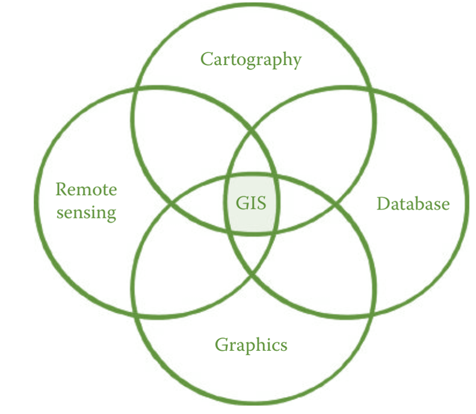
]

---
# Definition of GIS
.f3[A GIS is a computerized information system like any other database, but all the information in a GIS must be linked to a geographic reference.]

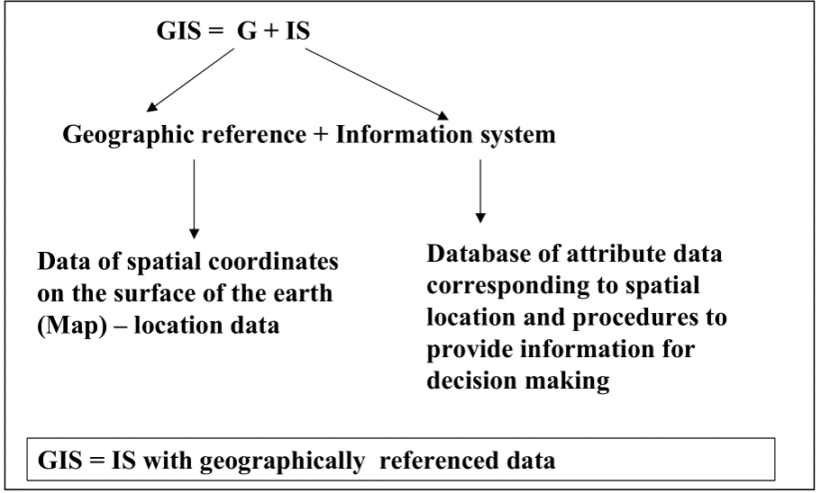

--

- .dark-blue[ESRI also provided a more straightforward definition of GIS as a computer system capable of holding and using data describing places on the earth's surface.]

--

- .dark-blue[The United States Geological Survey (USGS) defined provided A GIS as a computer hardware and software system designed to collect, manage, analyze and display geographically (spatially) referenced data.]

---
# What can a GIS do?

There are five basic questions that a complete GIS must answer. These are:

1. What exists at a particular location? <br /> 
*Given a geographic reference (eg, lat, long) for a location, the GIS must describe the features of that location.*

--

1. Where can specific features be found? <br /> 
*This is the converse of the first question. For example, where are the districts with rainfall greater than 500 mm and less than 750 mm?*

--

1. Trends or What has changed over time? <br /> 
*This involves answering both questions above. For example, at what locations are the crop yields showing declining trends?*

--

1. What spatial patterns exist? <br /> 
*If an occurrence of a pest is associated with a hypothesized set of conditions of temperature, precipitation, and humidity, where do those conditions exist?*

--

1. Modelling or What if? <br /> 
*This is a higher level application of GIS and answers questions like what would be the nitrate distribution in groundwater over the area if fertilizer use is doubled?*

---
# How to locate something on earth?
.pull-left[
- A GIS is to be created from maps of different thematic layers (soils, land use, temperature, etc.). 

- The maps are in two dimensions, whereas the earth's surface is a 3- dimensional ellipsoid. Every map has a projection and scale.

- To understand how maps are created by projecting the 3-d earth's surface into a 2-d plane of an analog map, we need to understand the georeferencing concepts.
]
.pull-right[
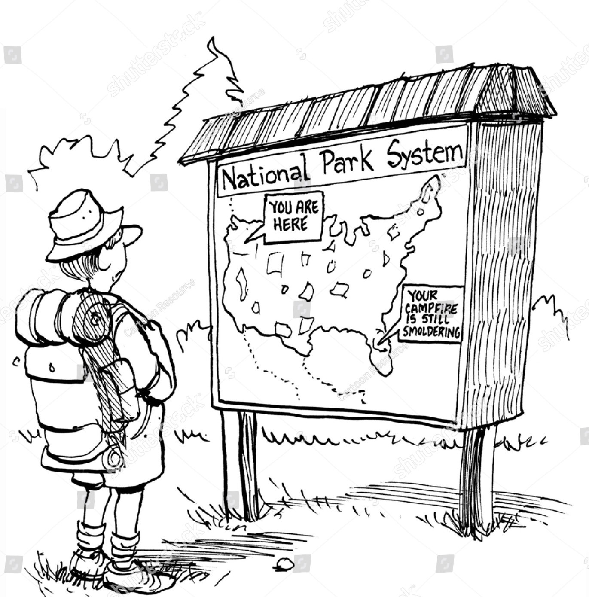
]

---
# Creating a map
specifying the 3-dimensional coordinate system that is used for locating points on the earth's surface, that is, 

- Geographic Coordinate System (GCS), and 
- Projected Coordinate System,

Projections are used for projecting into two dimensions for creating analog maps.

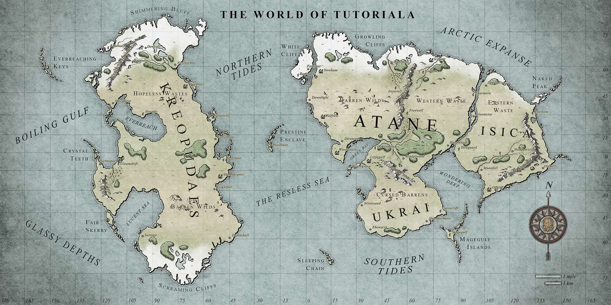

---
# Geodetic Systems (the earth, geoid, ellipsoid, spheroid and datum)
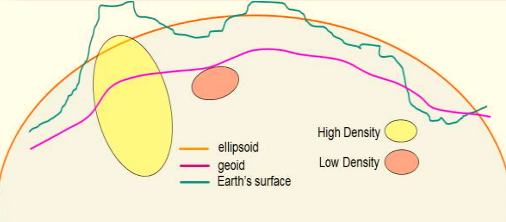

.f3[.dark-blue[Geodesy:] a branch of applied mathematics concerned with the determination of the size and shape of the earth and the exact positions of points on its surface and with the description of variations of its gravity field.]

---
# The Geoid

- As the density of the planet is inconsistent, gravitational forces pull in or push out the earth’s surface in different places, resulting in a planet that looks more like a lumpy potato than an egg.

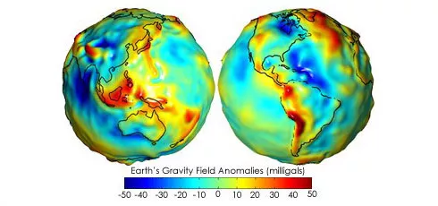

- Models that approximate the lumpy potato we call home are called geoids. 

- The *'equipotential surface'* that most closely corresponds to mean sea level.

---
# Ellipsoids
- More accurately, the shape of the Earth is an ellipsoid.
- While ellipsoids are round and smooth like spheres, they are not symmetrical when divided in all directions.

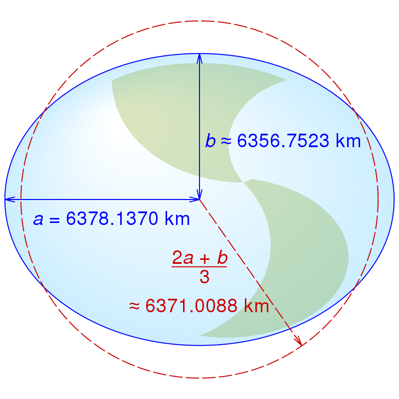

---
# Local and Global Ellipsoids
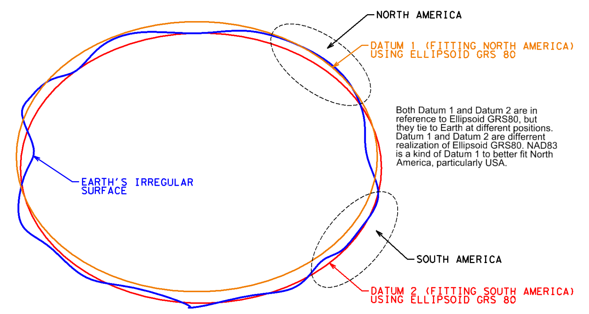

.footnote[ [rashms.com](https://rashms.com/gis/earth-ellipsoid-coordinate-reference-system-crs-projection-epsg-codes-in-gis/) ]

---
# Datum and Spheroid

- A spheroid is a three-dimensional shape created from a two-dimensional ellipse. .red[(WGS84 1984)]
  - spheroid is distinguished from another by the lengths of the semimajor and semiminor axes. 

--

- A spheroid approximates the shape of the earth, a datum defines the position of the spheroid relative to the center of the earth. .red[(WGS 1984)]
--

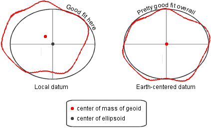

.footnote[[geo.hunter.cuny.edu](http://www.geo.hunter.cuny.edu/~jochen/GTECH201/Lectures/Lec6concepts/Datums/Components%20of%20a%20datum.htm)]

---
# Process of map making
.pull-left[
- A 3-dimensional coordinate system to locating points on the earth’s surface:

  - Geographic Coordinate System (GCS)
  - Projected Coordinate System 

- They are used for projecting into two dimensions for creating analogue maps.

]
.pull-right[

]

---
# Geographic Coordinate Systems (GCS)
.b.dark-blue[The geographic coordinate system (GCS) is a spherical or ellipsoidal coordinate system for measuring and communicating positions directly on the Earth as latitude and longitude.]

--

.pull-left[
**The geodetic latitude** of a point is the angle from the equatorial plane to the vertical direction of a line normal to the reference ellipsoid.

**The geodetic longitude** of a point is the angle between a reference plane and a plane passing through the point, both planes being perpendicular to the equatorial plane.

**The geodetic height** at a point is the distance from the reference ellipsoid to the point in a direction normal to the ellipsoid.

]
.pull-right[
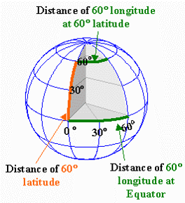
]

---
# Projected Coordinate System
- A projected coordinate system is a flat, two-dimensional surface. 
- A projected coordinate system has constant lengths, angles, and areas across the two dimensions. 
- A projected coordinate system is always based on a geographic coordinate system that is based on a sphere or spheroid.

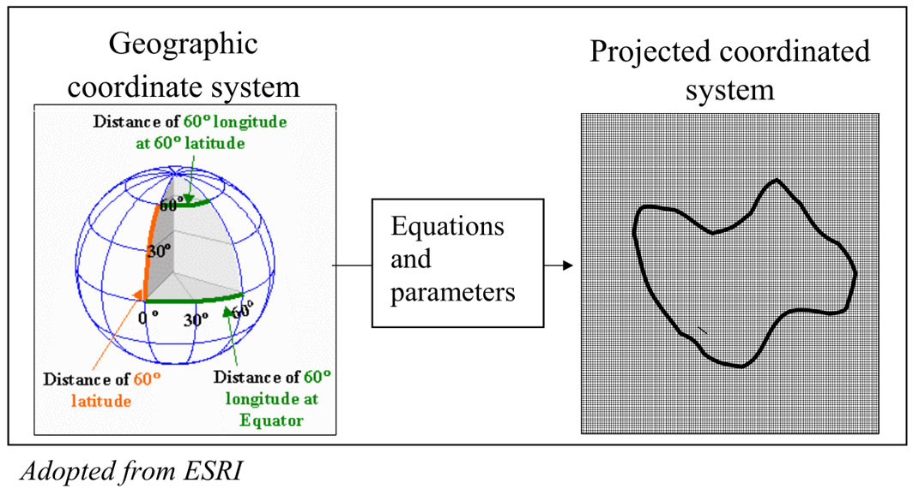

---
# Projected Coordinate System
Projection is a mathematical transformation used to project the real 3-dimensional spherical surface of the earth in 2-dimensions on a plane sheet of paper.

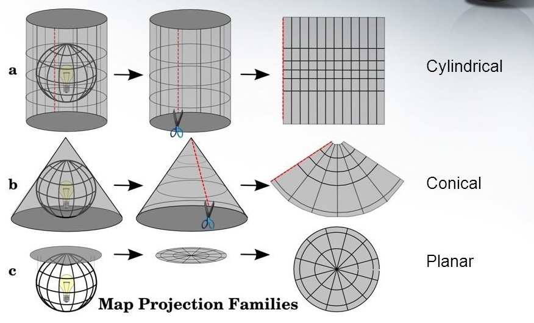

---
## Depending on the scale and the agreeable tradeoffs with respect to distortions, a specific projection form is chosen.
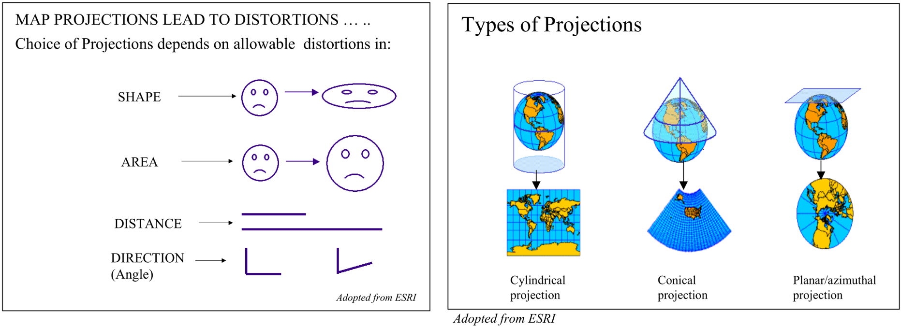

--

- Different countries have adopted different standard projections at different map scales. 

- In India, the polyconic projection is commonly used by Survey of India (SOI). 

---
# Georeferencing

Georeferencing is the process of assigning locations to geographical objects within a geographic frame of reference. 

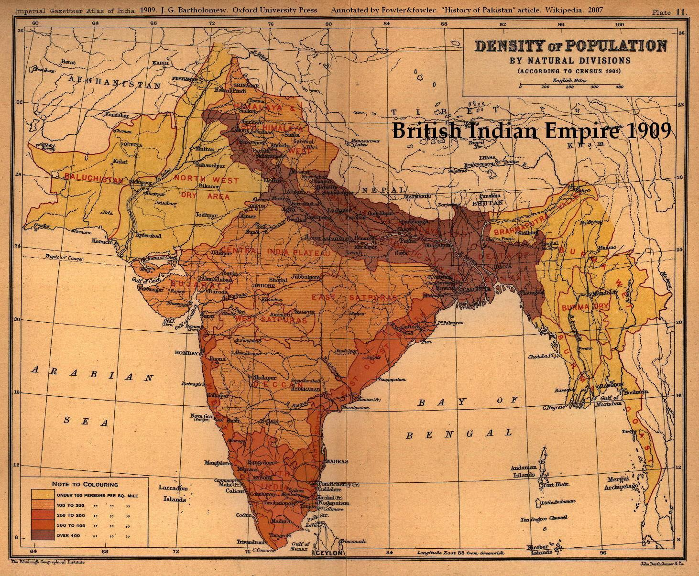
.gray.center[An old map of India]

---
# Distortions of map 

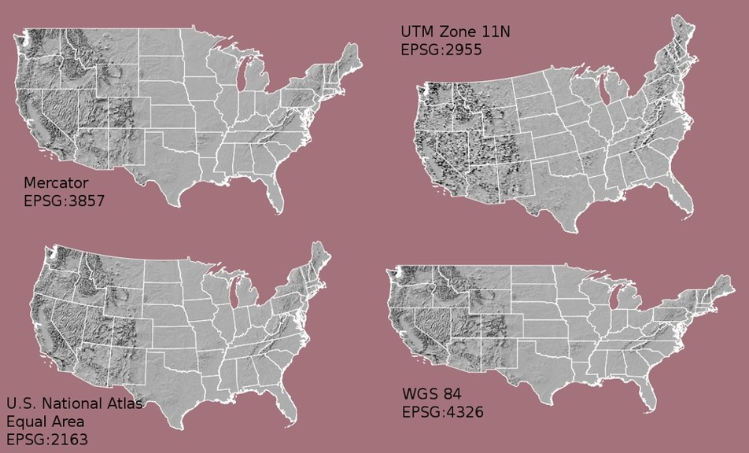
.footnote[Source: https://knowwhereconsulting.co.uk/]

---
# Map projections with angular conformity
Maintaining correct angular properties and preservation of angular relationships. 

--


--

.dark-red[Examples are the Mercator projection (as shown in Fig) and the Lambert Conformal Conic projection.]

---
# Map projections with equal distance
The projection that preserve distances well called equidistant projections. 

--


--

.red[The Plate Carree Equidistant Cylindrical] (as shown in Fig) and .red[the Equirectangular projection] are two good examples of equidistant projections.

---
# Projections with equal areas
- Equal areas maps are used when calculations of area are required. 
- An equal area projection creates distortions of angular conformity.

--


--

**Alber’s equal area, Lambert’s equal area** and **Mollweide Equal Area Cylindrical projections** (as shown in Fig) are types of equal area projections that are often encountered in GIS work.

---
# CRS in Q-GIS

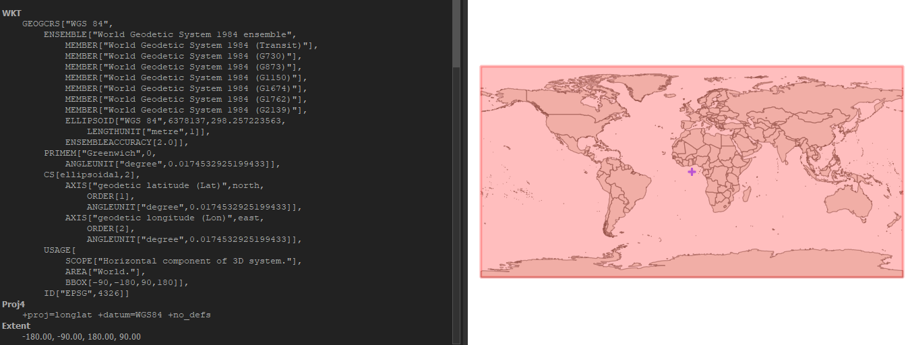

---

# GIS Data Input
.pull-left[
Spatial Data capture can be in two basic formats:

- .red[Raster format:] the reality is represented as grid of cells/pixels. The raster format is based on continuous fields view of reality (photographs, imageries, etc. 

- .red[Vector format:] the reality is represented as points lines and areas. The Vector format is based on discrete objects view of reality (analogue maps) 

]

.pull-right[
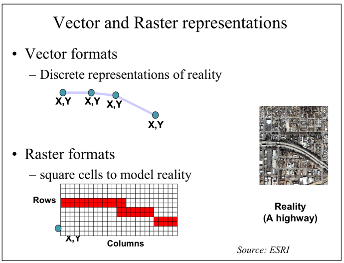
]

--

In principle, any real world situation can be represented in digital form in both raster and vector formats.

---
# Vector vs. Raster Data
.pull-left[

]

.pull-right[
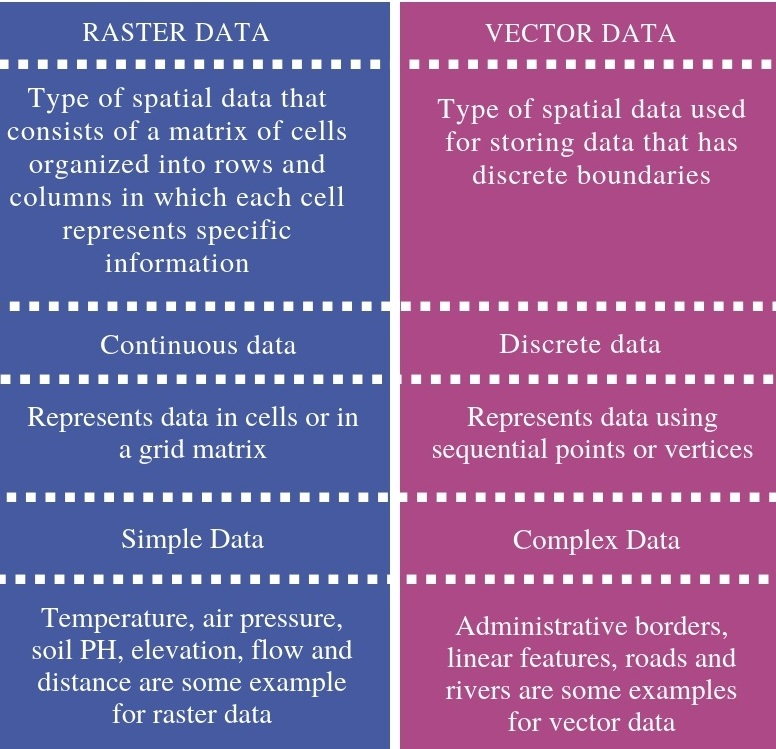
]

---
# Vector data type
.pull-left[
- Vector data provide a way to represent real world features within the GIS environment.
- A feature is anything you can see on the landscape.
- A vector feature has its shape represented using geometry. 
- The geometry is made up of one or more interconnected vertices.

-----

.dark-pink[
1. point features,
2. line features and
3. polygon or area features.
]

]
.pull-right[
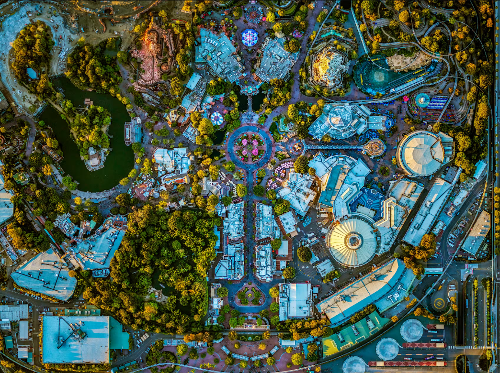
]

.footnote[read more:: https://docs.qgis.org/2.8/en/docs/gentle_gis_introduction/vector_data.html]

---
# Point, Line, and Polygon features
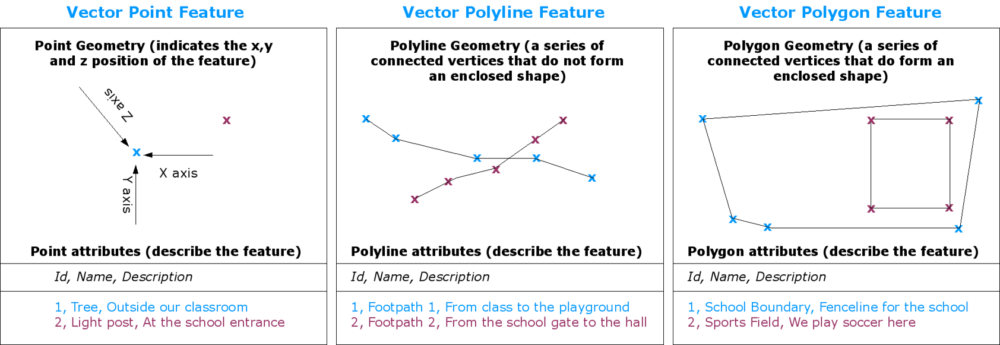

--
<br /> <br /> 
The most common vector datatype used in GIS are .dark-red.b[Shapefiles] 

---
# What are the shapefile files?

.b.dark-pink[Main File (.SHP):] is a mandatory Esri file that gives features their geometry. 

.b.dark-pink[dBASE File (.DBF):] is a standard database file used to store attribute data and object IDs. A `.DBF` file is mandatory for shape files. You can open .dbf files in Microsoft Access or Excel.

.b.dark-pink[Projection File (.PRJ):] is an optional file that contains the metadata associated with the shapefiles coordinate and projection system. I

.b.dark-pink[Index File (.SHX):] is a mandatory Esri shape index position file.

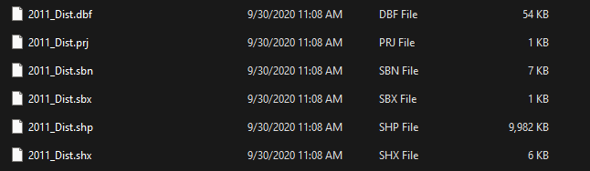

.footnote[Source: https://gisgeography.com/arcgis-shapefile-files-types-extensions/]

---
# Attribute data/ Attribute table
<div class="flex"> <div class="w-30 pa2 mr1">
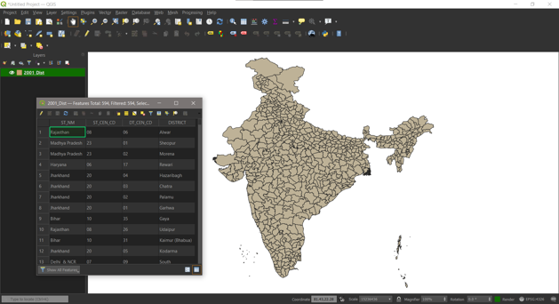 <br /> 

○  Attribute data are descriptive data of point, line and area features.  <br /> <br /> 

○ For points, this may be the name of the location, its elevation, etc. <br /> <br /> 
○ For lines attribute data could be the name of a road etc.

--

</div> <div class="w-70 pa2 mr1">
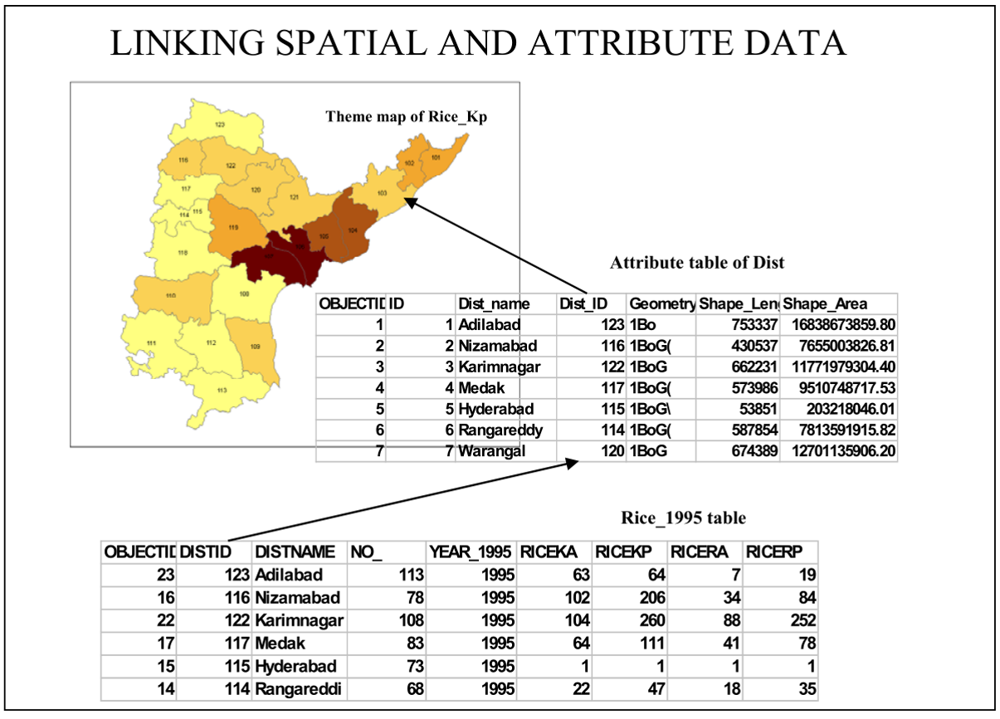
</div> </div>

---
# Shapefiles for India  [`r fontawesome::fa("download", fill = "green")`](https://1drv.ms/u/s!AhkMSf-s9DI5k4tsmwsWjpuzJiZsDg?e=tSlcct)

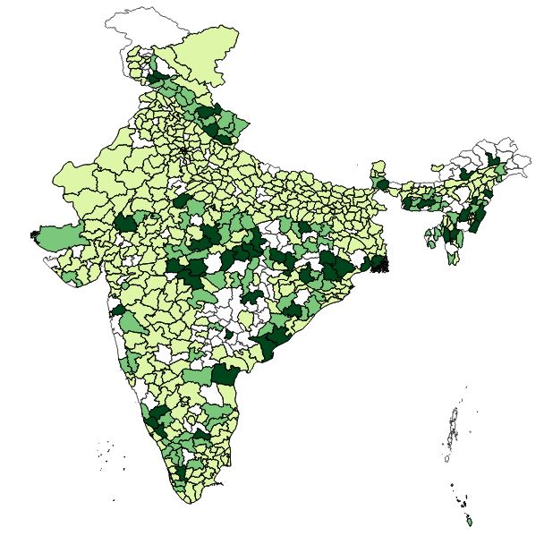

---
# Shape file processing 

1. Create Shapefiles
  1. Point
  2. Line
  3. Area

--

1. Attribute table

--

1. Joins 

--

1. Operations

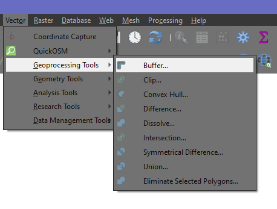

---

# Pluging in QGIS
**`Plugins > Manage and Install Plugins`**

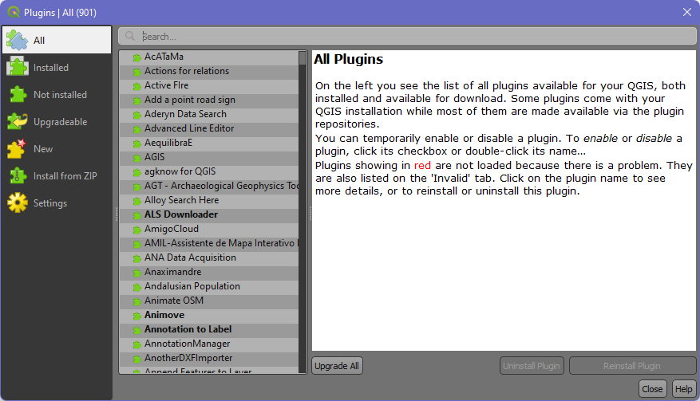

---

# Download raster
Shuttle Radar Topography Mission (SRTM)SRTM
Link: https://www.earthdata.nasa.gov/sensors/srtm


---
# Land use and Land cover data
Decadal Land Use and Land Cover Classifications across India, 1985, 1995, 2005

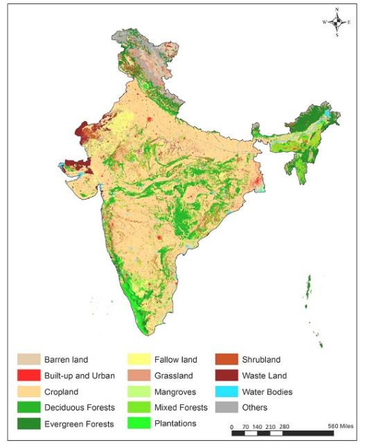

---

# Download SRTM data with .b.blue[SRTM Downloader]
.pull-left[
1. Install Plugin from Plug-in menu.
2. Open SRTM by clicking the SRTM logo.
3. Use OSM map for guide and set the zoom accordingly 
4. Click .red[Set canvas extent] to select area
5. Click download, it will prompt a log in dialogue.
6. Go to https://urs.earthdata.nasa.gov//users/new to create USGS account. 
]
.pull-right[
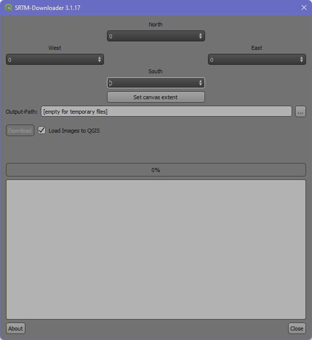
]

---
# Add map themes with `QuickMapService`

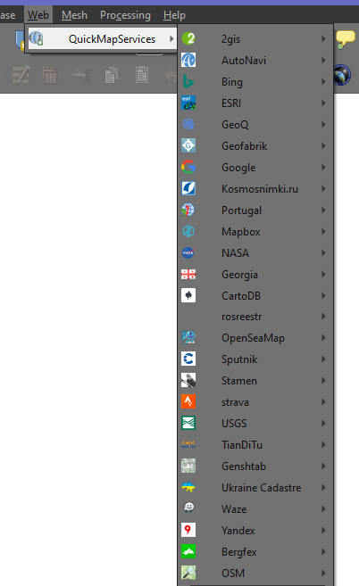

QuickMapServices: Easy to add basemaps

Easy to use list of services and search for finding datasets and basemaps. Please contribute new services via http://qms.nextgis.com! Developed by NextGIS.

---
# Reprojecting a raster 

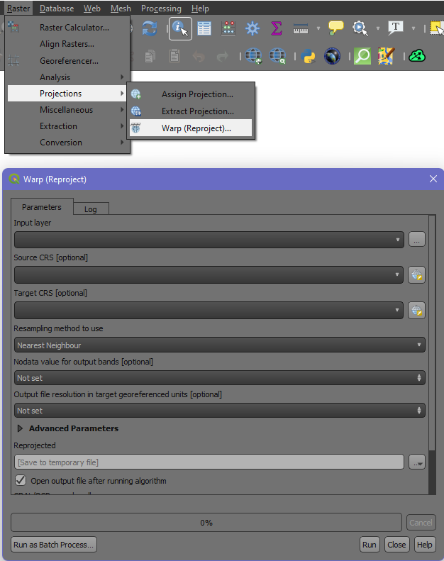

---
# Reprojecting a Vector

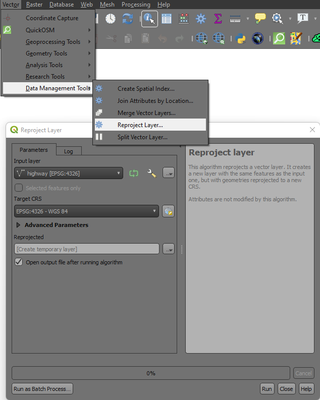

---
# Extracting OSM maps with `QuickOSM` plugin
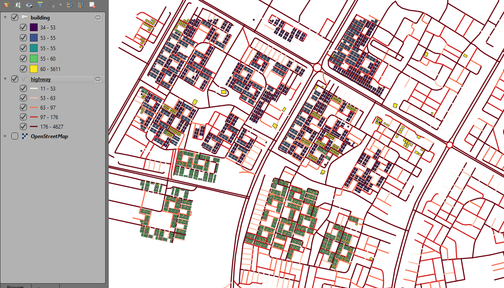
